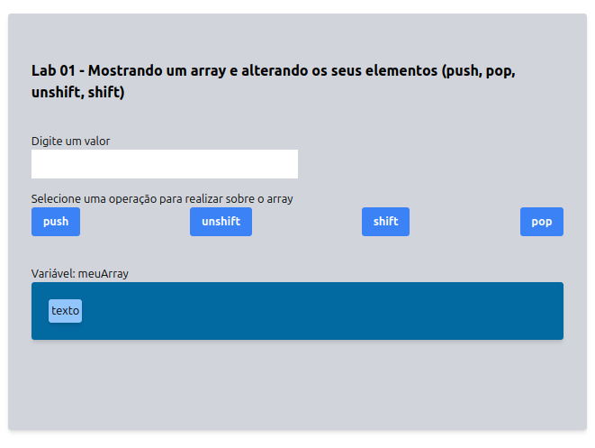

# Arrays

## Sumário
- [Introdução](#introdução)
- [Criando um array](#criando-um-array)
- [Acessando Elementos](#acessando-elementos)
- [Métodos](#métodos)
- [Iterando no Array](#iterando-no-array)
- [Laboratório](#laboratório)

## Introdução

A definição padrão para um array é uma coleção linear de elementos, onde estes podem ser acessados por meio de índices numéricos. Arrays são uma parte fundamental de qualquer linguagem de programação e funcionam de forma similar em todas elas, com pequenas particularidades. 

No Javascript eles são um tipo particular de objeto, onde os índices são os nomes das propriedades e podem ser utilizados para posições. Quando valores inteiros são usados como índices, eles são convertidos internamente para strings para serem acessados como objetos.

Nos ambientes de execução do JavaScript ele é um recurso muito utilizado. Principalmente após as melhorias propostas no ES6, pois ganharam diversos métodos para manipular a coleção de dados armazenados. Algumas das características mais distintivas dos arrays no Javascript são:


- São objetos 
- Acessados por índice numérico ou string
- Tamanho dinâmico

## Criando um array
É possível criar um array de várias maneiras:

- Usando colchetes:

Arrays são contruídas de colchetes, os quais contém uma lista de itens separada por vírgulas. Vamos supor que queremos armazenar uma lista de compras em uma array 

```js
let frutas = ['maçã', 'banana', 'laranja'];
```

- Usando o construtor Array, passando os elementos:

Podemos passar no construtor da classe Array a lista de elementos separados por vírgula. Veja o exemplo a seguir com uma sequencia de números e de nomes

```js
let numeros = new Array(1, 2, 3, 4, 5);

let array = new Array("Casa", "Comida", "Roupa lavada")

```

- Usando o construtor Array, passando o tamanho:

Também podemos passar no construtor da classe Array o tamanho. Veja o exemplo a seguir com um Array com tamanho 5. 


```js
let array = new Array(5)
console.log(array.length);
```

Observe que utilizando apenas um parametro nós definimos o tamanho. Caso seja usado dois ou mais nós estaremos passando a sequencia de elementos.

```js
let array = new Array(5,6)
for (let num of array){
    console.log(num);
}
```
## Acessando Elementos

Os elementos em um array são acessados usando o índice, que começa em 0.

```js
let frutas = ['maçã', 'banana', 'laranja'];
let primeiraFruta = frutas[0]; // 'maçã'
let segundaFruta = frutas[1];  // 'banana
```

Também é possível acessar os elementos usando o índice no formato string. Isso ocorre pois os valores em string são interpretados como atributos de um objeto, observe que podemos criar um atributo dinämico com o nome "quitanda" e acessa-lo por índice ou atributo
```js
let frutas = ['maçã', 'banana', 'laranja'];
let primeiraFruta = frutas["0"]; // 'maçã'
let segundaFruta = frutas["1"];  // 'banana

frutas.quitanda = "Quitanda do seu zé"
console.log(frutas["quitanda"])
console.log(frutas.quitanda)
```

Quando você acessa uma posição em um array que não foi definida em JavaScript, o valor retornado será undefined. Isso ocorre porque a posição solicitada não possui um valor atribuído.

```js
let array = [1, 2, 3];
console.log(array[5]); // undefined
```
No exemplo acima, array[5] retorna undefined porque o array array tem apenas 3 elementos (índices 0, 1 e 2). O índice 5 não foi definido.

Quando você cria um array com um comprimento específico sem inicializar os elementos, os espaços não preenchidos são considerados empty slots (espaços vazios) e retornarão undefined quando acessados.

```js
let arrayFixo = new Array(5);
console.log(arrayFixo[2]); // undefined
```

Em outras linguagens isso poderia ocasionar um erro/excessão que causaria o encerramento do programa caso não for tratado. Ainda assim, no Javascript é possível testar se determinado valor está presente em um array, veja o exemplo a seguir:

```js
let array = [1, 2, 3];

console.log(4 in array); // false
console.log(array.hasOwnProperty(4)); // false

array[4] = 5;

console.log(4 in array); // true
console.log(array.hasOwnProperty(4)); // true
```

Observe que no exemplo acima o array foi criado com tamanho 3, com os elementos [1,2,3] e em seguida foi definido uma posição 4 com o elemento 5. Isso implica que o tamanho de um array não é fixo.
## Arrays são objetos

Arrays são objetos,  eles possuem as propriedades acessadas por índices e uma série de métodos embutidos para realizar operações de travessia e mutação. Os elementos de um array são somente propriedades, da mesma forma que length é uma propriedade. Contudo, note que tentando acessar o primeiro elemento de um array da seguinte forma causará um erro de sintaxe, pois o nome da propriedade é inválido:
```js
console.log(arr.0); // um erro de sintaxe
```

Não há nada de especial a respeito de arrays JavaScript e suas propriedades que causam isso. As propriedades JavaScript que começam com um dígito não podem ser referenciadas com notação de ponto. Elas necesitam usar notação de colchetes para poderem ser acessadas. Por exemplo, se você tivesse um objeto com a propriedade "3d", também teria que ser referenciá-la usando notação de colchetes. Por exemplo:

```js
let objeto = {}
objeto.nome = "Woody"
console.log(objeto.nome)

//objeto.3d = "modelo 3d" // erro
objeto["3d"] = "modelo 3d"
console.log(objeto["3d"])
```
## Métodos

### Representações de String de Arrays
Existem duas funções que retornam representações de string de um array: `join()` e `toString()`. Ambas as funções retornam uma string contendo os elementos do array delimitados por vírgulas. Aqui estão alguns exemplos:

```javascript
let names = ["David", "Cynthia", "Raymond", "Clayton", "Mike", "Jennifer"];
let namestr = names.join();
console.log(namestr); // David,Cynthia,Raymond,Clayton,Mike,Jennifer
namestr = names.toString();
console.log(namestr); // David,Cynthia,Raymond,Clayton,Mike,Jennifer
```

Quando você chama a função `console.log()` com o nome de um array, ela automaticamente chama a função `toString()` para esse array:

### Clonando Arrays

Existem duas funções que permitem criar novos arrays a partir de arrays existentes: `concat()` e `splice()`. A função `concat()` permite juntar dois ou mais arrays para criar um novo array, e a função `splice()` permite criar um novo array a partir de um subconjunto de um array existente.

Vamos primeiro ver como a função `concat()` funciona. A função é chamada a partir de um array existente, e seu argumento é outro array existente. O argumento é concatenado ao final do array que chama `concat()`. O programa a seguir demonstra como `concat()` funciona:

```javascript
let cisDept = ["Mike", "Clayton", "Terrill", "Danny", "Jennifer"];
let dmpDept = ["Raymond", "Cynthia", "Bryan"];
let itDiv = cisDept.concat(dmpDept);
console.log(itDiv);
itDiv = dmpDept.concat(cisDept);
console.log(itDiv);
```

O programa gera a seguinte saída:

```
Mike,Clayton,Terrill,Danny,Jennifer,Raymond,Cynthia,Bryan
Raymond,Cynthia,Bryan,Mike,Clayton,Terrill,Danny,Jennifer
```

A primeira linha de saída mostra os dados do array `cisDept` primeiro, e a segunda linha de saída mostra os dados do array `dmpDept` primeiro.

A função `splice()` cria um novo array a partir do conteúdo de um array existente. Os argumentos para a função são a posição inicial para a extração e o número de elementos a serem retirados do array existente. Veja como o método funciona:

```javascript
let itDiv = ["Mike","Clayton","Terrill","Raymond","Cynthia","Danny","Jennifer"];
let dmpDept = itDiv.splice(3,3);
let cisDept = itDiv;
console.log(dmpDept); // Raymond,Cynthia,Danny
console.log(cisDept); // Mike,Clayton,Terrill,Jennifer
```

### Alterando Arrays (Adicionando e Removendo Elementos)

O JavaScript possui um conjunto de funções mutadoras que permitem modificar o conteúdo de um array sem referenciar os elementos individuais. Essas funções frequentemente tornam técnicas complexas mais fáceis, como você verá abaixo.

#### Adicionando Elementos a um Array

Existem duas funções mutadoras para adicionar elementos a um array: `push()` e `unshift()`. 

A função `push()` adiciona um elemento ao final de um array:

```javascript
let nums = [1,2,3,4,5];
console.log(nums); // 1,2,3,4,5
nums.push(6);
console.log(nums); // 1,2,3,4,5,6
```

A função mutadora para adicionar elementos de array ao início de um array é `unshift()`. Aqui está como a função funciona:

```javascript
let nums = [2,3,4,5];
console.log(nums); // 2,3,4,5
let newnum = 1;
nums.unshift(newnum);
console.log(nums); // 1,2,3,4,5
nums = [3,4,5];
nums.unshift(newnum,1,2);
console.log(nums); // 1,2,3,4,5
```

A segunda chamada para `unshift()` demonstra que você pode adicionar múltiplos elementos a um array com uma única chamada da função.

#### Removendo Elementos de um Array
Remover um elemento do final de um array é fácil usando a função mutadora `pop()`:

```javascript
let nums = [1,2,3,4,5,9];
nums.pop();
console.log(nums); // 1,2,3,4,5
```

A função mutadora que precisamos para remover um elemento do início de um array é `shift()`. Aqui está como a função funciona:

```javascript
let nums = [9,1,2,3,4,5];
nums.shift();
console.log(nums); // 1,2,3,4,5
```

Você notará que não há elementos extras deixados no final do array. Tanto `pop()` quanto `shift()` retornam os valores que removem, para que você possa coletar os valores em uma letiável:

```javascript
let nums = [6,1,2,3,4,5];
let first = nums.shift(); // first recebe o valor 9
nums.push(first);
console.log(nums); // 1,2,3,4,5,6
```

### Adicionando ou Removendo no Meio de um Array

Tentar adicionar ou remover elementos no meio de um array leva aos mesmos problemas que encontramos ao tentar adicionar ou remover elementos do início de um array—ambas as operações exigem deslocar os elementos do array, seja para o início ou para o fim. No entanto, existe uma função mutadora que podemos usar para realizar ambas as operações: splice().

Para adicionar elementos a um array usando splice(), você deve fornecer os seguintes argumentos:

O índice inicial (onde você quer começar a adicionar elementos)
O número de elementos a remover (0 quando você está adicionando elementos)
Os elementos que você deseja adicionar ao array
Vamos ver um exemplo simples. O programa a seguir adiciona elementos ao meio de um array:

```javascript
let nums = [1,2,3,7,8,9];
let newElements = [4,5,6];
nums.splice(3,0,newElements);
console.log(nums); // 1,2,3,4,5,6,7,8,9
```

Aqui está um exemplo de uso de splice() para remover elementos de um array:
```javascript
let nums = [1,2,3,100,200,300,400,4,5];
nums.splice(3,4);
console.log(nums); // 1,2,3,4,5
```
## Iterando no Array

Existem várias maneiras de iterar sobre um array. Aqui estão algumas das mais comuns:
 
### 1. Usando um Loop `for`

O loop `for` é uma das formas mais tradicionais de iterar sobre um array.

```javascript
let array = ['maçã', 'banana', 'laranja'];

for (let i = 0; i < array.length; i++) {
    console.log(array[i]);
}
```

### 2. Usando um Loop `for...of`

O loop `for...of` é uma maneira moderna e mais legível de iterar sobre os elementos de um array.

```javascript
let array = ['maçã', 'banana', 'laranja'];

for (let fruta of array) {
    console.log(fruta);
}
```

### 3. Usando o Método `forEach`

O método `forEach` executa uma função fornecida uma vez para cada elemento do array.

```javascript
let array = ['maçã', 'banana', 'laranja'];

array.forEach(function(fruta, indice) {
    console.log(indice, fruta);
});
```

### 4. Usando o Loop `while`

Você também pode usar um loop `while` para iterar sobre um array.

```javascript
let array = ['maçã', 'banana', 'laranja'];
let i = 0;

while (i < array.length) {
    console.log(array[i]);
    i++;
}
```

### 5. Usando o Loop `do...while`

O loop `do...while` é similar ao `while`, mas garante que o bloco de código seja executado pelo menos uma vez.

```javascript
let array = ['maçã', 'banana', 'laranja'];
let i = 0;

do {
    console.log(array[i]);
    i++;
} while (i < array.length);
```

### 6. Usando o Método `map`

Embora o método `map` seja mais frequentemente usado para transformar arrays, ele também pode ser usado para iterar.

```javascript
let array = ['maçã', 'banana', 'laranja'];

array.map(function(fruta) {
    console.log(fruta);
});
```

### 7. Usando o Método `for...in`

O loop `for...in` é usado para iterar sobre propriedades enumeráveis de um objeto. Para arrays, ele pode ser usado, mas não é recomendado porque pode iterar sobre propriedades herdadas.

```javascript
let array = ['maçã', 'banana', 'laranja'];

for (let indice in array) {
    console.log(array[indice]);
}
```

#### Comparação 

- **`for` e `while`**: Flexíveis e permitem controle total sobre o loop, mas podem ser verbosos.
- **`for...of`**: Mais legível e fácil de usar para a maioria dos casos de iteração de arrays.
- **`forEach`**: Simples e direto, mas não pode ser interrompido (break).
- **`map`**: Ideal para transformar arrays, mas pode ser usado para iteração simples.
- **`for...in`**: Não recomendado para arrays, ele é mais apropriado para objetos.

### Métodos para iteração e transformação do array 

Iterar com métodos sobre arrays em JavaScript é uma prática comum, pois eles são menos verbosos e possuem sintaxe simples. Vamos ver alguns exemplos de como podemos utilizá-los: 

1. Processamento de Dados

Ao iterar sobre um array, você pode aplicar alguma operação a cada elemento, como transformação, filtragem ou agregação de dados.

Exemplo: Transformação de Dados
Suponha que você tenha um array de números e queira criar um novo array com cada número multiplicado por 2.

```js
let numeros = [1, 2, 3, 4, 5];
let numerosDobrados = numeros.map(function(numero) {
    return numero * 2;
});
console.log(numerosDobrados); // [2, 4, 6, 8, 10]
```

2. Filtragem de Dados

Você pode iterar sobre um array para criar um novo array que contenha apenas os elementos que atendem a certos critérios.

Exemplo: Filtragem de Dados
Suponha que você queira obter todos os números maiores que 2

```js
let numeros = [1, 2, 3, 4, 5];
let numerosMaioresQueDois = numeros.filter(function(numero) {
    return numero > 2;
});
console.log(numerosMaioresQueDois); // [3, 4, 5]
```

3. Busca de Dados

A iteração permite encontrar elementos específicos dentro de um array.

Exemplo: Busca de Dados
Suponha que você queira encontrar o primeiro número maior que 2.
```js
let numeros = [1, 2, 3, 4, 5];
let primeiroMaiorQueDois = numeros.find(function(numero) {
    return numero > 2;
});
console.log(primeiroMaiorQueDois); // 3
```

4. Agregação de Dados

Iterar sobre um array permite acumular valores para calcular totais, médias, ou outros agregados.

Exemplo: Soma de Elementos
Suponha que você queira calcular a soma de todos os números no array.
```js
let numeros = [1, 2, 3, 4, 5];
let soma = numeros.reduce(function(total, numero) {
    return total + numero;
}, 0);
console.log(soma); // 15
```

5. Atualização de Elementos

Você pode iterar sobre um array para atualizar os elementos com base em alguma lógica.

Exemplo: Atualização de Elementos
Suponha que você queira adicionar 1 a cada número no array.

```js
let numeros = [1, 2, 3, 4, 5];
numeros.forEach(function(numero, indice, array) {
    array[indice] = numero + 1;
});
console.log(numeros); // [2, 3, 4, 5, 6]
```

7. Criação de Estruturas Derivadas

A iteração permite criar novas estruturas de dados baseadas nos elementos do array original.

Exemplo: Criação de Objetos
Suponha que você queira transformar um array de nomes em um array de objetos.
```js
let nomes = ['Ana', 'João', 'Maria'];
let pessoas = nomes.map(function(nome) {
    return { nome: nome };
});
console.log(pessoas);
// [{ nome: 'Ana' }, { nome: 'João' }, { nome: 'Maria' }]

```

8. Executar Ações Baseadas em Condições

Iterar sobre um array permite executar ações condicionais em cada elemento.

Exemplo: Ações Condicionais
Suponha que você queira logar apenas os números pares do array.
```js
let numeros = [1, 2, 3, 4, 5];
numeros.forEach(function(numero) {
    if (numero % 2 === 0) {
        console.log(numero);
    }
});
// Output: 2, 4
```

9. Ordenação de Elementos
   
Você pode iterar sobre um array para implementar algoritmos de ordenação personalizados.

Exemplo: Ordenação
Embora o método sort faça a maior parte do trabalho, você pode precisar de iteração para algoritmos de ordenação complexos.
```js
let numeros = [5, 2, 9, 1, 5, 6];
numeros.sort(function(a, b) {
    return a - b;
});
console.log(numeros); // [1, 2, 5, 5, 6, 9]
```
## Laboratório

1 - A partir do template publicado no laboratorio/lab01, crie uma aplicação web com javascript/html e css que tenha as seguintes funcionalidades:
 - Mostrar os dados de um array em uma div da página 
 - Receber um valor utilizando um input na página e o insira no array ao selecionar botões (push e unshift ), posteriormente mostrando na div da página. 
 - Remova um valor utilizando botões (shift e pop) do array, posteriormente mostrando na div da página



2 - A partir da questão anterior, implemente as funções que modificam o array, adicionando e removendo elementos, usando o loop for e método slice. Queremos o comportamento das funções unshift, push, pop e shift. As funções deverão ter a seguinte assinatura: 
- function push(array, elemento): Adiciona um elemento ao final de um array.
- function unshift(array, elemento): Adiciona um elemento ao início de um array. Cada elemento existente do array precisa ser deslocado uma posição para cima antes que o novo dado seja adicionado. 
- function pop(array): Remova o último elemento do array. 
- function shift(array): Remova o primeiro elemento do array, deslocando as posições posteriores. Remover elementos do início de um array requer deslocar os elementos para o início do array


3 - Utilizando o template do laboratorio/lab03, utilize as funções de travessia e transformação do array para aplicar as seguintes funcionalidades:
- sort: Ordenar os elementos do array
- filter: Filtrar os elentos do array maiores que 2
- map: Passar por todos os elementos do array, dobrando o seu valor
- find: Encontrar o primeiro elemento do array com valor igual a 10
- reduce: Aplicar um cálculo para todos os elementos do array e acumulando o resultado da soma em um acumulador


4 - Implemente as seguintes funções usando o loop for e adicione os botões para estas funções no laboratorio/lab04:

- dobrarNumeros(array): Recebe um array de números e retorna um novo array com cada número dobrado.
- filtrarMaioresQueDois(array): Recebe um array de números e retorna um novo array com os números maiores que 2.
- encontrarPrimeiroMaiorQueDois(array): Recebe um array de números e retorna o primeiro número maior que 2.
- somarElementos(array): Recebe um array de números e retorna a soma de todos os elementos.
- adicionarUm(array): Recebe um array de números e adiciona 1 a cada número do array original (modificando o array original).
- criarObjetos(array): Recebe um array de strings e retorna um novo array de objetos, onde cada objeto tem uma propriedade nome com o valor correspondente da string.
- logarPares(array): Recebe um array de números e loga no console apenas os números pares.

5 - Utilizando como base o template no laboratorio/lab05, crie uma função de busca para um número digitado pelo usuário. Sua aplicação deverá informar a quantidade de comparações realizadas ao longo da pesquisa e se o número foi encontrado ou não.

