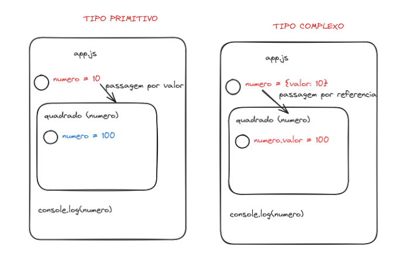

# Funções


## Introdução
 

Muitas vezes precisamos realizar uma mesma ação em vários lugares do programa/script.Por exemplo, precisamos mostrar uma mensagem bonita quando um visitante faz login, sai e talvez em outro lugar.

Já vimos exemplos de funções integradas, como alert(message), prompt(message, default) e confirm(question). Mas também podemos criar nossas próprias funções.

### Definição

De modo geral, uma função é um “subprograma” que pode ser chamado por código externo (ou interno, no caso de recursão) à função. Assim como o próprio programa, uma função é composta por uma sequência de instruções chamada corpo da função. Os valores podem ser passados ​​para uma função como parâmetros e a função retornará um valor.

### Objetos de Primeira Classe

Em JavaScript, as funções são objetos de primeira classe, porque podem ser passadas para outras funções, retornadas de funções e atribuídas a variáveis ​​e propriedades. Eles também podem ter propriedades e métodos como qualquer outro objeto. O que os distingue de outros objetos é que funções podem ser chamadas.

## Criando uma função

Há mais uma forma de criar funções: 
 - Declarando
 - Criando expressões
 - Sintaxe reduzida

### Declarando Funções 

A definição da função (também chamada de declaração de função) consiste no uso da palavra chave **function**, seguida por:

    Nome da Função.
    Lista de argumentos para a função, entre parênteses e separados por vírgulas.
    Declarações JavaScript que definem a função, entre chaves { }.

Por exemplo, o código a seguir define uma função simples chamada square:
```js
function square(numero) {
  return numero * numero;
}
```

A função square recebe um argumento chamado numero. A função consiste em uma instrução que indica para retornar o argumento da função (isto é, numero) multiplicado por si mesmo. A declaração return especifica o valor retornado pela função.

```js
return numero * numero;

```

### Expressões de função

Embora a declaração de função anterior seja sintaticamente uma declaração, funções também podem ser criadas por uma expressão de função. Tal função pode ser anônima; ele não tem que ter um nome. Por exemplo, a função square poderia ter sido definida como:

```js
let square = function (numero) {
  return numero * numero;
};
let x = square(4); //x recebe o valor 16

```

No entanto, um nome pode ser fornecido com uma expressão de função e pode ser utilizado no interior da função para se referir a si mesma, ou em um debugger para identificar a função em stack traces:

```js
var fatorial = function fac(n) {
  return n < 2 ? 1 : n * fac(n - 1);
};

console.log(fatorial(3));
```


## Chamando funções

Ao criar uma função você não a executa, ela é simplesmente nomeada e especifica o que fazer. Chamar a função executa realmente as ações especificadas com os parâmetros indicados. Por exemplo, se você definir a função square, você pode chamá-la do seguinte modo:
```js

square(5);
```
A declaração anterior chama a função com o argumento 5. A função executa as instruções e retorna o valor 25.

Funções devem estar no escopo quando são chamadas, mas a declaração de uma função pode ser puxada para o topo (aparecem abaixo da chamada no código), como neste exemplo:

```js
console.log(square(5));
/* ... */
function square(n){return n*n}
```

O escopo de uma função é a função na qual ela é declarada, ou todo o programa se ela é declarada no nível superior.

Nota: Nota: Isso funciona apenas quando a definição da função usa a sintaxe acima (ex., function funcNome(){ }). O código a seguir não vai funcionar.

```js

console.log(square(5));
var square = function (n) {
  return n * n;
};
```
### Argumentos

Os argumentos de uma função não estão limitados a strings e números. Você pode passar objetos para uma função. Um função pode chamar a si mesma. Por exemplo, a função que calcula os fatoriais recursivamente:

```js

function fatorial(n) {
  if (n == 0 || n == 1) return 1;
  else return n * fatorial(n - 1);
}
```
Você poderia, então, calcular os fatoriais de um a cinco:
```js

var a, b, c, d, e;
a = fatorial(1); // a recebe o valor 1
b = fatorial(2); // b recebe o valor 2
c = fatorial(3); // c recebe o valor 6
d = fatorial(4); // d recebe o valor 24
e = fatorial(5); // e recebe o valor 120
```

O exemplo a seguir mostra uma função map sendo definida e, em seguida, chamada com uma função anônima como seu primeiro parâmetro:

```js
function map(f, a) {
  var result = []; // Cria um novo Array
  var i;
  for (i = 0; i != a.length; i++) result[i] = f(a[i]);
  return result;
}
```
O código a seguir retorna [0, 1, 8, 125, 1000].

```js
map(
  function (x) {
    return x * x * x;
  },
  [0, 1, 2, 5, 10],
);

```

    Há outras maneiras de chamar funções. Muitas vezes há casos em que uma função precisa ser chamada dinamicamente, ou o número de argumentos de uma função varia, ou em que o contexto da chamada de função precisa ser definido para um objeto específico determinado em tempo de execução. Acontece que as funções são, por si mesmas, objetos, e esses objetos por sua vez têm métodos. Um desses, o método apply(), pode ser usado para atingir esse objetivo.

### Parametros Primitivos e Complexos

Parâmetros primitivos (como um número) são passados para as funções por valor; o valor é passado para a função, mas se a função altera o valor do parâmetro, esta mudança não reflete globalmente ou na função chamada.

Se você passar um objeto (ou seja, um valor não primitivo, tal como Array ou um objeto definido por você) como um parâmetro e a função alterar as propriedades do objeto, essa mudança é visível fora da função, conforme mostrado no exemplo a seguir:

```js
function minhaFuncao(objeto) {
  objeto.make = "Toyota";
}

var meucarro = { make: "Honda", model: "Accord", year: 1998 };
var x, y;

x = meucarro.make; // x recebe o valor "Honda"

minhaFuncao(meucarro);
y = meucarro.make; // y recebe o valor "Toyota"
// (a propriedade make foi alterada pela função)

```



### Hoisting (içar/elevar, em português)

As declarações de de variáveis e funções são colocadas na memória durante a fase de compilação. Mesmo que chamemos a função em nosso código primeiro, antes que a função seja escrita, o código ainda funciona. Isto ocorre por conta de como a execução de contexto funciona em JavaScript.

Hoisting funciona bem com outros tipos de dados e variáveis. As variáveis podem ser inicializadas e usadas antes de serem declaradas.
Apenas declarações são hoisted(içadas, em português)

O JavaScript apenas eleva (hoists) as declarações, não as inicializações. Se uma variável for declarada e inicializada após usá-la, o valor será undefined. Por exemplo:

```js
console.log(num); // Retorna undefined
var num;
num = 6;

```

Se você declarar a variável depois que ela for usada, mas inicializá-la antecipadamente, ela retornará o valor:

```js
num = 6;
console.log(num); // retorna 6
var num;
```

Caso você não declare a variável com var, let ou const, o interpretador irá declarar ela de forma automática para você e não mostrará erro. Mas isso é uma má prática de programação.

```js
num = 6;
console.log(num); // retorna 6
```


## Escopo da função

As variáveis definidas no interior de uma função não podem ser acessadas de nenhum lugar fora da função, porque a variável está definida apenas no escopo da função. No entanto, uma função pode acessar todas variáveis e funções definida fora do escopo onde ela está definida. Em outras palavras, a função definida no escopo global pode acessar todas as variáveis definidas no escopo global. A função definida dentro de outra função também pode acessar todas as variáveis definidas na função hospedeira e outras variáveis ao qual a função hospedeira tem acesso.
```js

// As seguintes variáveis são definidas no escopo global
var num1 = 20,num2 = 3,nome = "Chamahk";

// Esta função é definida no escopo global
function multiplica() {
  return num1 * num2;
}

multiplica(); // Retorna 60

// Um exemplo de função aninhada
function getScore() {
  var num1 = 2,
    num2 = 3;

  function add() {
    return nome + " scored " + (num1 + num2);
  }

  return add();
}

getScore(); // Retorna "Chamahk scored 5"
```

## Recursão

Uma função pode referir-se e chamar a si própria. Há três maneiras de uma função referir-se a si mesma:

    o nome da função
    arguments.callee
    uma variável no escopo que se refere a função

Por exemplo, considere a seguinte definição de função:

```js

var foo = function bar() {
  // declaracoes
};
```

Dentro do corpo da função, todos, a seguir, são equivalentes:

    bar()
    arguments.callee()
    foo()

Uma função que chama a si mesma é chamada de função recursiva. Em alguns casos, a recursividade é análoga a um laço. Ambos executam o código várias vezes, e ambos necessitam de uma condição (para evitar um laço infinito, ou melhor, recursão infinita, neste caso). Por exemplo, o seguinte laço:

```js

var x = 0;
while (x < 10) {
  // "x < 10" a condição do laço
  // faça coisas
  x++;
}
```
pode ser convertido em função recursiva e uma chamada para a função:
```js

function loop(x) {
  if (x >= 10)
    // "x >= 10" a condição de parada (equivalente a "!(x < 10)")
    return;
  // faça coisas
  loop(x + 1); // chamada recursiva
}
loop(0);
```
No entanto, alguns algoritmos não podem ser simples laços iterativos. Por exemplo, conseguir todos os nós da estrutura de uma árvore (por exemplo, o DOM) é mais fácil se feito recursivamente:
```js

function walkTree(node) {
  if (node == null)
    //
    return;
  // faça algo com o nó
  for (var i = 0; i < node.childNodes.length; i++) {
    walkTree(node.childNodes[i]);
  }
}
```
Em comparação ao laço da função, cada chamada recursiva realiza outras chamadas recursivas.

É possível converter qualquer algoritmo recursivo para um não recursivo, mas muitas vezes a lógica é muito mais complexa e exige o uso de pilhas. Na verdade a própria recursão usa pilha: a pilha de função.

O comportamento da pilha pode ser vista a seguir no exemplo:
```js

function foo(i) {
  if (i < 0) return;
  document.writeln("begin:" + i);
  foo(i - 1);
  document.writeln("end:" + i);
}
foo(3);
```
que produz:

begin:3
begin:2
begin:1
begin:0
end:0
end:1
end:2
end:3

## Funções aninhadas e closures

Você pode aninhar uma função dentro de outra. A função aninhada (interna) é acessível apenas para a função que a contém (exterior). Isso constitui uma **closure**. Uma closure é uma expressão (tipicamente uma função) que pode ter variáveis livres em conjunto com um ambiente que conecta estas variáveis (que "fecha" a expressão).

Uma vez que uma função aninhada é uma closure, isto significa que uma função aninhada pode "herdar" os argumentos e variáveis de sua função de contenção. Em outras palavras, a função interior contém o escopo da função exterior.

Em resumo:

    A função interna só pode ser acessada a partir de declarações em função externa.
    A função interna forma uma closure: a função interna pode usar os argumentos e variáveis da função externa, enquanto a função externa não pode usar os argumentos e variáveis da função interna.

O exemplo a seguir mostra as funções aninhadas:
```js

function addSquares(a, b) {
  function square(x) {
    return x * x;
  }
  return square(a) + square(b);
}
a = addSquares(2, 3); // retorna 13
b = addSquares(3, 4); // retorna 25
c = addSquares(4, 5); // retorna 41
```
Uma vez que a função interna forma uma closure, você pode chamar a função externa e especificar argumentos para a função externa e interna:
```js

function fora(x) {
  function dentro(y) {
    return x + y;
  }
  return dentro;
}
fn_inside = fora(3); // Pense nisso como: Receba uma função que adicionará 3 ao que quer que você repasse para ela
result = fn_inside(5); // retorna 8

result1 = fora(3)(5); // retorna 8
```

### Preservação de variáveis

Observe como x é preservado quando dentro é retornado. Uma closure deve preservar os argumentos e variáveis em todos os escopos que ela referencia. Uma vez que cada chamada fornece potencialmente argumentos diferentes, uma nova closure é criada para cada chamada de fora. A memória só poderá ser liberada quando o dentro retornado já não é mais acessível.

Isso não é diferente de armazenar referências em outros objetos, mas muitas vezes é menos óbvio, porque um não define diretamente as referências e não pode inspecioná-las.
Múltiplas funções aninhadas

Funções podem ter múltiplo aninhamento, por exemplo, a função (A) contém a função (B) que contém a função (C). Tanto as funções B e C formam uma closure, então B pode acessar A, e C pode acessar B. Além disso, uma vez que C pode acessar B que pode acessar A, C também pode acessar A. Assim, a closure pode conter vários escopos; eles recursivamente contém o escopo das funções que os contém. Isso é chamado encadeamento de escopo. 

Considere o seguinte exemplo:

```js

function A(x) {
  function B(y) {
    function C(z) {
      alert(x + y + z);
    }
    C(3);
  }
  B(2);
}
A(1); // Exibe um alerta com o valor 6 (1 + 2 + 3)
```

Neste exemplo, C acessa y do B e x do A. Isso pode ser feito porque:

    B forma uma closure incluindo A, isto é, B pode acessar argumentos e variáveis de A.
    C forma uma closure incluindo B.
    Devido a closure B inclui A, a closure C inclui A, C pode acessar tanto argumentos e variáveis de B como de A. Em outras palavras, C encadeia o escopo de B e A, nesta ordem.

O inverso, no entanto, não é verdadeiro. A não pode acessar C, porque A não pode acessar qualquer argumento ou variável de B. Assim, C é privado somente a B.
Conflitos de nome

Quando dois argumentos ou variáveis nos escopos da closure tem o mesmo nome, há um conflito de nome. Mas escopos internos tem prioridade, por isso o escopo mais interno tem a maior prioridade, enquanto que o escopo mais externo tem a menor. Esta é a cadeia de escopo. O primeiro da cadeia é o escopo mais interno, e o último é o escopo mais externo. Considere o seguinte:

```js

function fora() {
  var x = 10;
  function dentro(x) {
    return x;
  }
  return dentro;
}
result = fora()(20); // retorna 20 em vez de 10
```
O conflito de nome acontece na declaração return x e está entre o parâmetro x de dentro e a variável x de fora. A cadeia de escopo aqui é {dentro, fora, objeto global}. Por isso o x de dentro tem precedência sobre o x de fora, e 20 (x de dentro) é retornado em vez de 10 (x de fora).

### Closures

Closures são um dos recursos mais poderosos de JavaScript. JavaScript permite o aninhamento de funções e garante acesso completo à função interna a todas as variáveis e funções definidas dentro da função externa (e todas as outras variáveis e funções que a função externa tem acesso). 

No entanto, a função externa não tem acesso às variáveis e funções definidas dentro da função interna. Isto proporciona uma espécie de segurança para as variáveis da função interna. Além disso, uma vez que a função interna tem acesso ao escopo da função externa, as variáveis e funções definidas na função externa vão durar na memória mais do que a própria função externa, isto se a função interna permanecer na memória mais tempo do que a função externa. 

Uma closure é criada quando a função interna é de alguma forma disponibilizada para qualquer escopo fora da função externa.
```js

var pet = function (nome) {
    // A função externa define uma variável "nome"
    var getNome = function () {
      return nome; // A função interna tem acesso à variável "nome"  da função externa
    };

    return getNome; // Retorna a função interna, expondo-a assim para escopos externos
  },
  myPet = pet("Vivie");

myPet(); // Retorna "Vivie"
```
Ela pode ser mais complexa que o código acima. Um objeto contendo métodos para manipular as variáveis da função externa pode ser devolvida.
```js

var criarPet = function (nome) {
  var sex;

  return {
    setNome: function (newNome) {
      nome = newNome;
    },

    getNome: function () {
      return nome;
    },

    getSex: function () {
      return sex;
    },

    setSex: function (newSex) {
      if (
        typeof newSex == "string" &&
        (newSex.toLowerCase() == "macho" || newSex.toLowerCase() == "fêmea")
      ) {
        sex = newSex;
      }
    },
  };
};

var pet = criarPet("Vivie");
pet.getNome(); // Vivie

pet.setNome("Oliver");
pet.setSex("macho");
pet.getSex(); // macho
pet.getNome(); // Oliver
```
Nos códigos acima, a variável nome da função externa é acessível para as funções internas, e não há nenhuma outra maneira para acessar as variáveis internas, exceto pelas funções internas. As variáveis internas da função interna atuam como armazenamento seguro para as funções internas. Elas armazenam "persistentes", mas seguros, os dados com os quais as funções internas irão trabalhar. As funções não tem que ser atribuídas a uma variável, ou ter um nome.
```js

var getCode = (function () {
  var secureCode = "0]Eal(eh&2"; // Um código que não queremos que pessoas de fora sejam capazes de modificar

  return function () {
    return secureCode;
  };
})();

getCode(); // Retorna o secureCode
```
Há, no entanto, uma série de armadilhas que se deve ter cuidado ao usar closures. Se uma função fechada define uma variável com o mesmo nome de uma variável em um escopo externo, não há nenhuma maneira de se referir para a variável em um escopo externo novamente.
```js

var createPet = function (nome) {
  // Função externa define uma variável chamada "nome"
  return {
    setNome: function (nome) {
      // Função fechada define uma variável chamada "nome"
      nome = nome; // ??? Como podemos acessar o "nome" definido pela função externa ???
    },
  };
};
```
A palavra reservada this é muito complicada em closures, elas têm de ser usadas com muito cuidado. O objeto ao que this se refere depende completamente de onde a função foi chamada, ao invés de onde ela foi definida.
Usando objeto de argumentos

Os argumentos de uma função são mantidos em um objeto do tipo array. Dentro de uma função, você pode endereçar os argumentos passados para ele conforme:
js

arguments[i];

onde i é um número ordinal do argumento, começando com zero. Então, o primeiro argumento passado para a função seria arguments[0]. O número total de argumentos é indicado por arguments.length.

Usando o objeto arguments, você pode chamar a função com mais argumentos do que o formalmente declarado. Isso muitas vezes é útil se você não sabe de antemão quantos argumentos serão passados para a função. Você pode usar arguments.length para determinar a quantidade de argumentos passados para a função, e então acessar cada argumento usando o objeto arguments.

Por exemplo, considere uma função que concatena várias strings. O argumento formal para a função é uma string que especifica os caracteres que separam os itens para concatenar. A função definida como segue:
```js

function myConcat(separador) {
  var result = "", // inicializa a lista
    i;
  // itera por meio de argumentos
  for (i = 1; i < arguments.length; i++) {
    result += arguments[i] + separador;
  }
  return result;
}
```
Você pode passar qualquer quantidade de argumentos para esta função, e ela concatena cada argumento na string "list":
```js

// retorna "red, orange, blue, "
myConcat(", ", "red", "orange", "blue");

// retorna "elephant; giraffe; lion; cheetah; "
myConcat("; ", "elephant", "giraffe", "lion", "cheetah");

// retorna "sage. basil. oregano. pepper. parsley. "
myConcat(". ", "sage", "basil", "oregano", "pepper", "parsley");
```
Nota: Nota: A variável arguments é "como um array", mas não é um array. Ela é como um array pois possui um índice numerado e a propriedade length. No entanto, não possui todos os métodos de manipulação de array.

Veja objeto Function na referência do JavaScript para maiores informações.
Parâmetros de função

Começando com ECMAScript 6, há dois tipos novos de parâmetros: parâmetros padrão e parâmetros rest.
Parâmetros padrão

Em JavaScript, parâmetros padrões de funções são undefined. No entanto, em algumas situações pode ser útil definir um valor padrão diferente. Isto é onde os parâmetros padrão podem ajudar.

No passado, a estratégia geral para definir padrões era testar os valores de parâmetro no corpo da função e atribuir um valor se eles fossem undefined. Se, no exemplo a seguir, nenhum valor é fornecido para b na chamada, seu valor seria undefined ao avaliar a*b e a chamada para multiplicar retornaria NaN. No entanto, isso é pego com a segunda linha neste exemplo:
js

function multiplicar(a, b) {
  b = typeof b !== "undefined" ? b : 1;

  return a * b;
}

multiplicar(5); // 5

Com parâmetros padrão, a verificação no corpo da função não é mais necessária. Agora você pode simplesmente colocar 1 como valor padrão para b no campo de declaração de parâmetros:
js

function multiplicar(a, b = 1) {
  return a * b;
}

multiplicar(5); // 5

Mais detalhes, consulte parâmetros padrão na referência.
Parâmetros rest

A sintaxe de parâmetro rest permite representar um número indefinido de argumentos como um array. No exemplo, usamos parâmetros rest para coletar argumentos do segundo argumento ao último. Então os multiplicamos pelo primeiro argumento. Neste exemplo é usado uma arrow function, que será introduzida na próxima seção.
```js

function multiplicar(multiplicador, ...args) {
  return args.map((x) => multiplicador * x);
}

var arr = multiplicar(2, 1, 2, 3);
console.log(arr); // [2, 4, 6]
```
Funções de seta

Uma expressão função de seta (anteriormente conhecida como função de seta gorda) tem uma sintaxe pequena em comparação com a expressão de função e lexicalmente vincula o valor this. Funções de seta são sempre anônimas. Consulte também no blog hacks.mozilla.org no post: "ES6 In Depth: Arrow functions".

Dois fatores influenciaram a introdução de funções de seta: funções mais curtas e o léxico this.
Funções curtas

Em alguns padrões funcionais, funções curtas são bem-vindas. Compare:
```js

var a = ["Hydrogen", "Helium", "Lithium", "Beryllium"];

var a2 = a.map(function (s) {
  return s.length;
});

var a3 = a.map((s) => s.length);
```

Léxico this

Até as funções de seta, cada nova função definia seu próprio valor this (um novo objeto no caso de um construtor, indefinido em chamadas de função no modo estrito, o objeto de contexto se a função é chamada como um "método de objeto", etc.). Isso pode ser irritante com um estilo de programação orientada a objetos.
```js

function Pessoa() {
  // O construtor Pessoa() define 'this' como sendo ele.
  this.idade = 0;
  setInterval(function crescer() {
    // No modo não estrito, a função crescer define 'this'
    // como o objeto global, o que é diferente do 'this'
    // definido pelo construtor Pessoa().
    this.idade++;
  }, 1000);
}
var p = new Pessoa();
```

No ECMAScript 3/5, este problema foi resolvido atribuindo o valor em this a uma variável que poderia ser fechada.

```js
function Pessoa() {
  var self = this; // Alguns preferem 'that' em vez de 'self'.
  // Escolha um e seja consistente.
  self.idade = 0;

  setInterval(function crescer() {
    // A chamada de retorno refere-se à variável 'self' na qual
    // o valor é o objeto esperado.
    self.idade++;
  }, 1000);
}
```
Como alternativa, uma função vinculada poderia ser criada para que o valor da propriedade this seja passado para a função crescer().

Funções de seta capturam o valor this do contexto delimitado, então o código a seguir funciona conforme o esperado.
```js
function Pessoa(){
  this.idade = 0;

  setInterval(() => {
    this.idade++; // propriedade |this|refere ao objeto pessoa
  }, 1000);
}

var p = new Pessoa();
```
Funções pré-definidas

JavaScript tem várias funções pré-definidas:

eval()

    O método eval() avalia código JavaScript representado como uma string.
uneval() Non-standard

    O método uneval() cria uma representação de string do código-fonte de um Object.
isFinite()

    A função global isFinite() determina se o valor passado é um número finito. Se necessário, o parâmetro é primeiro convertido para um número.
isNaN()

    A função isNaN() determina se um valor é NaN ou não. Nota: coerção dentro da função isNaN tem regras interessantes; você pode, alternativamente, querer usar Number.isNaN(), como definido no ECMAScript 6, ou você pode usar typeof para determinar se o valor não é um número.
parseFloat()

    A função parseFloat() analisa um argumento do tipo string e retorna um número de ponto flutuante.
parseInt()

    A função parseInt() analisa um argumento do tipo string e retorna um inteiro da base especificada (base do sistema numérico).
decodeURI()

    A função decodeURI() decodifica uma Uniform Resource Identifier (URI) criada anteriormente por encodeURI ou por uma rotina similar.
decodeURIComponent()

    O método decodeURIComponent() decodifica um componente Uniform Resource Identifier (URI) criado anteriormente por encodeURIComponent ou por uma rotina similar.
encodeURI()

    O método encodeURI() codifica um Uniform Resource Identifier (URI), substituindo cada ocorrência de determinados caracteres por um, dois, três, ou quatro sequências de escape que representa a codificação UTF-8 do caractere (só serão quatro sequências de escape para caracteres compostos de dois caracteres "substitutos").
encodeURIComponent()

    O método encodeURIComponent() codifica um componente Uniform Resource Identifier (URI), substituindo cada ocorrência de determinados caracteres por um, dois, três, ou quatro sequências de escape que representa a codificação UTF-8 do caractere (só serão quatro sequências de escape para caracteres compostos de dois caracteres "substitutos").
escape() Deprecated

    O método obsoleto escape() calcula uma nova string na qual certos caracteres foram substituídos por uma sequência de escape hexadecimal. Use encodeURI ou encodeURIComponent em vez disso.
unescape() Deprecated

    O método obsoleto unescape() calcula uma nova string na qual sequências de escape hexadecimais são substituídas pelo caractere que ela representa. As sequências de escape podem ser introduzidas por uma função como escape. Por unescape() estar obsoleto, use decodeURI() ou decodeURIComponent ao invés dele.
