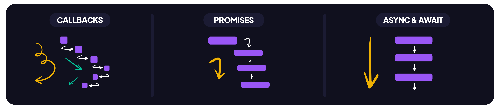

# Funções


## Introdução
 

Muitas vezes precisamos realizar uma mesma ação em vários lugares do programa/script.Por exemplo, precisamos mostrar uma mensagem bonita quando um visitante faz login, sai e talvez em outro lugar.

Já vimos exemplos de funções integradas, como alert(message), prompt(message, default) e confirm(question). Mas também podemos criar nossas próprias funções.

### Definição

De modo geral, uma função é um “subprograma” que pode ser chamado por código externo (ou interno, no caso de recursão) à função. Assim como o próprio programa, uma função é composta por uma sequência de instruções chamada corpo da função. Os valores podem ser passados ​​para uma função como parâmetros e a função retornará um valor.

### Objetos de Primeira Classe

Em JavaScript, as funções são objetos de primeira classe, porque podem ser passadas para outras funções, retornadas de funções e atribuídas a variáveis ​​e propriedades. Eles também podem ter propriedades e métodos como qualquer outro objeto. O que os distingue de outros objetos é que funções podem ser chamadas.

## Criando uma função

Há mais uma forma de criar funções: 
 - Declarando
 - Criando expressões
 - Sintaxe reduzida

### Declarando Funções 

A definição da função (também chamada de declaração de função) consiste no uso da palavra chave **function**, seguida por:

    Nome da Função.
    Lista de argumentos para a função, entre parênteses e separados por vírgulas.
    Declarações JavaScript que definem a função, entre chaves { }.

Por exemplo, o código a seguir define uma função simples chamada square:
```js
function square(numero) {
  return numero * numero;
}
```

A função square recebe um argumento chamado numero. A função consiste em uma instrução que indica para retornar o argumento da função (isto é, numero) multiplicado por si mesmo. A declaração return especifica o valor retornado pela função.

```js
return numero * numero;

```

### Expressões de função

Embora a declaração de função anterior seja sintaticamente uma declaração, funções também podem ser criadas por uma expressão de função. Tal função pode ser anônima; ele não tem que ter um nome. Por exemplo, a função square poderia ter sido definida como:

```js
let square = function (numero) {
  return numero * numero;
};
let x = square(4); //x recebe o valor 16

```

No entanto, um nome pode ser fornecido com uma expressão de função e pode ser utilizado no interior da função para se referir a si mesma, ou em um debugger para identificar a função em stack traces:

```js
var fatorial = function fac(n) {
  return n < 2 ? 1 : n * fac(n - 1);
};

console.log(fatorial(3));
```


## Chamando funções

Ao criar uma função você não a executa, ela é simplesmente nomeada e especifica o que fazer. Chamar a função executa realmente as ações especificadas com os parâmetros indicados. Por exemplo, se você definir a função square, você pode chamá-la do seguinte modo:
```js

square(5);
```
A declaração anterior chama a função com o argumento 5. A função executa as instruções e retorna o valor 25.

Funções devem estar no escopo quando são chamadas, mas a declaração de uma função pode ser puxada para o topo (aparecem abaixo da chamada no código), como neste exemplo:

```js
console.log(square(5));
/* ... */
function square(n){return n*n}
```

O escopo de uma função é a função na qual ela é declarada, ou todo o programa se ela é declarada no nível superior.

Nota: Nota: Isso funciona apenas quando a definição da função usa a sintaxe acima (ex., function funcNome(){ }). O código a seguir não vai funcionar.

```js

console.log(square(5));
var square = function (n) {
  return n * n;
};
```
### Argumentos

Os argumentos de uma função não estão limitados a strings e números. Você pode passar objetos para uma função. Um função pode chamar a si mesma. Por exemplo, a função que calcula os fatoriais recursivamente:

```js

function fatorial(n) {
  if (n == 0 || n == 1) return 1;
  else return n * fatorial(n - 1);
}
```
Você poderia, então, calcular os fatoriais de um a cinco:
```js

var a, b, c, d, e;
a = fatorial(1); // a recebe o valor 1
b = fatorial(2); // b recebe o valor 2
c = fatorial(3); // c recebe o valor 6
d = fatorial(4); // d recebe o valor 24
e = fatorial(5); // e recebe o valor 120
```

O exemplo a seguir mostra uma função map sendo definida e, em seguida, chamada com uma função anônima como seu primeiro parâmetro:

```js
function map(f, a) {
  var result = []; // Cria um novo Array
  var i;
  for (i = 0; i != a.length; i++) result[i] = f(a[i]);
  return result;
}
```
O código a seguir retorna [0, 1, 8, 125, 1000].

```js
map(
  function (x) {
    return x * x * x;
  },
  [0, 1, 2, 5, 10],
);

```

    Há outras maneiras de chamar funções. Muitas vezes há casos em que uma função precisa ser chamada dinamicamente, ou o número de argumentos de uma função varia, ou em que o contexto da chamada de função precisa ser definido para um objeto específico determinado em tempo de execução. Acontece que as funções são, por si mesmas, objetos, e esses objetos por sua vez têm métodos. Um desses, o método apply(), pode ser usado para atingir esse objetivo.

### Parametros Primitivos e Complexos

Parâmetros primitivos (como um número) são passados para as funções por valor; o valor é passado para a função, mas se a função altera o valor do parâmetro, esta mudança não reflete globalmente ou na função chamada.

Se você passar um objeto (ou seja, um valor não primitivo, tal como Array ou um objeto definido por você) como um parâmetro e a função alterar as propriedades do objeto, essa mudança é visível fora da função, conforme mostrado no exemplo a seguir:

```js
function minhaFuncao(objeto) {
  objeto.make = "Toyota";
}

var meucarro = { make: "Honda", model: "Accord", year: 1998 };
var x, y;

x = meucarro.make; // x recebe o valor "Honda"

minhaFuncao(meucarro);
y = meucarro.make; // y recebe o valor "Toyota"
// (a propriedade make foi alterada pela função)

```


### Argumentos Rest

Quando você não sabe quantos argumentos a função pode receber, pode usar o operador rest (...) para coletar todos os argumentos restantes em um array.

```js
function somarTodos(...numeros) {
  let soma = 0
  for (let e of numeros){
    soma += e
  }
  return soma
}

console.log(somarTodos(1, 2, 3, 4, 5)); // 15
console.log(somarTodos(10, 20));         // 30

```

## Hoisting (içar/elevar, em português)

As declarações de de variáveis e funções são colocadas na memória durante a fase de compilação. Mesmo que chamemos a função em nosso código primeiro, antes que a função seja escrita, o código ainda funciona. Isto ocorre por conta de como a execução de contexto funciona em JavaScript.

Hoisting funciona bem com outros tipos de dados e variáveis. As variáveis podem ser inicializadas e usadas antes de serem declaradas.
Apenas declarações são hoisted(içadas, em português)

O JavaScript apenas eleva (hoists) as declarações, não as inicializações. Se uma variável for declarada e inicializada após usá-la, o valor será undefined. Por exemplo:

```js
console.log(num); // Retorna undefined
var num;
num = 6;

```

Se você declarar a variável depois que ela for usada, mas inicializá-la antecipadamente, ela retornará o valor:

```js
num = 6;
console.log(num); // retorna 6
var num;
```

Caso você não declare a variável com var, let ou const, o interpretador irá declarar ela de forma automática para você e não mostrará erro. Mas isso é uma má prática de programação.

```js
num = 6;
console.log(num); // retorna 6
```


## Escopo da função

As variáveis definidas no interior de uma função não podem ser acessadas de nenhum lugar fora da função, porque a variável está definida apenas no escopo da função. No entanto, uma função pode acessar todas variáveis e funções definida fora do escopo onde ela está definida. Em outras palavras, a função definida no escopo global pode acessar todas as variáveis definidas no escopo global. A função definida dentro de outra função também pode acessar todas as variáveis definidas na função hospedeira e outras variáveis ao qual a função hospedeira tem acesso.

```js

// As seguintes variáveis são definidas no escopo global
var num1 = 20,num2 = 3,nome = "Chamahk";

// Esta função é definida no escopo global
function multiplica() {
  return num1 * num2;
}

multiplica(); // Retorna 60

// Um exemplo de função aninhada
function getScore() {
  var num1 = 2,
    num2 = 3;

  function add() {
    return nome + " scored " + (num1 + num2);
  }

  return add();
}

getScore(); // Retorna "Chamahk scored 5"
```

## Funções aninhadas e closures

Você pode aninhar uma função dentro de outra. A função aninhada (interna) é acessível apenas para a função que a contém (exterior). Isso constitui uma **closure**. Uma closure é uma expressão (tipicamente uma função) que pode ter variáveis livres em conjunto com um ambiente que conecta estas variáveis (que "fecha" a expressão).

Uma vez que uma função aninhada é uma closure, isto significa que uma função aninhada pode "herdar" os argumentos e variáveis de sua função de contenção. Em outras palavras, a função interior contém o escopo da função exterior.

Em resumo:

    A função interna só pode ser acessada a partir de declarações em função externa.
    A função interna forma uma closure: a função interna pode usar os argumentos e variáveis da função externa, enquanto a função externa não pode usar os argumentos e variáveis da função interna.

O exemplo a seguir mostra as funções aninhadas:

```js

function addSquares(a, b) {
  function square(x) {
    return x * x;
  }
  return square(a) + square(b);
}
a = addSquares(2, 3); // retorna 13
b = addSquares(3, 4); // retorna 25
c = addSquares(4, 5); // retorna 41

```
Uma vez que a função interna forma uma closure, você pode chamar a função externa e especificar argumentos para a função externa e interna:

```js

function fora(x) {
  function dentro(y) {
    return x + y;
  }
  return dentro;
}
fn_inside = fora(3); // Pense nisso como: Receba uma função que adicionará 3 ao que quer que você repasse para ela
result = fn_inside(5); // retorna 8

result1 = fora(3)(5); // retorna 8
```

### Preservação de variáveis

Observe como x é preservado quando dentro é retornado. Uma closure deve preservar os argumentos e variáveis em todos os escopos que ela referencia. Uma vez que cada chamada fornece potencialmente argumentos diferentes, uma nova closure é criada para cada chamada de fora. A memória só poderá ser liberada quando o dentro retornado já não é mais acessível.

Isso não é diferente de armazenar referências em outros objetos, mas muitas vezes é menos óbvio, porque um não define diretamente as referências e não pode inspecioná-las.
Múltiplas funções aninhadas

Funções podem ter múltiplo aninhamento, por exemplo, a função (A) contém a função (B) que contém a função (C). Tanto as funções B e C formam uma closure, então B pode acessar A, e C pode acessar B. Além disso, uma vez que C pode acessar B que pode acessar A, C também pode acessar A. Assim, a closure pode conter vários escopos; eles recursivamente contém o escopo das funções que os contém. Isso é chamado encadeamento de escopo. 

Considere o seguinte exemplo:

```js

function A(x) {
  function B(y) {
    function C(z) {
      alert(x + y + z);
    }
    C(3);
  }
  B(2);
}
A(1); // Exibe um alerta com o valor 6 (1 + 2 + 3)
```

Neste exemplo, C acessa y do B e x do A. Isso pode ser feito porque:

    B forma uma closure incluindo A, isto é, B pode acessar argumentos e variáveis de A.
    C forma uma closure incluindo B.
    Devido a closure B inclui A, a closure C inclui A, C pode acessar tanto argumentos e variáveis de B como de A. Em outras palavras, C encadeia o escopo de B e A, nesta ordem.

O inverso, no entanto, não é verdadeiro. A não pode acessar C, porque A não pode acessar qualquer argumento ou variável de B. Assim, C é privado somente a B.

#### Conflitos de nome

Quando dois argumentos ou variáveis nos escopos da closure tem o mesmo nome, há um conflito de nome. Mas escopos internos tem prioridade, por isso o escopo mais interno tem a maior prioridade, enquanto que o escopo mais externo tem a menor. Esta é a cadeia de escopo. O primeiro da cadeia é o escopo mais interno, e o último é o escopo mais externo. Considere o seguinte:

```js

function fora() {
  var x = 10;
  function dentro(x) {
    return x;
  }
  return dentro;
}
result = fora()(20); // retorna 20 em vez de 10
```
O conflito de nome acontece na declaração return x e está entre o parâmetro x de dentro e a variável x de fora. A cadeia de escopo aqui é {dentro, fora, objeto global}. Por isso o x de dentro tem precedência sobre o x de fora, e 20 (x de dentro) é retornado em vez de 10 (x de fora).


## Funções de seta

Uma expressão função de seta (arrow function) tem uma sintaxe pequena em comparação com a expressão de função, estas funções também são sempre anônimas.  Dois fatores influenciaram a introdução de funções de seta: funções mais curtas e o léxico this.

### Funções curtas

Em algumas situações que seguem padrões funcionais, as funções curtas são bem-vindas. Execute os exemplos do [Lab06](./labs/lab07-%20arrow/) e observe exemplos a seguir:

```js

const a = ["Hydrogen", "Helium", "Lithium", "Beryllium"];

// Formato 1
function calcLength(s) {
  return s.length;
}
const a1 = a.map(calcLength)

// Formato 2
const a2 = a.map(function (s) {
  return s.length;
});

// Formato 3
const a3 = a.map((s) => s.length);
```


## Módulos

Nas primeiras versões do JavaScript não havia sistema de módulos integrados. Todos os códigos escritos ficavam em um escopo global, tornando funções e variáveis ​​acessíveis de qualquer lugar. Isso poderia resultar em conflitos de nomenclatura em bases de código complexas. A falta de encapsulamento e modularidade dificultou aos desenvolvedores a reutilização de código em vários projetos.

A evolução dos módulos JavaScript resultou em uma abordagem mais organizada e sustentável para escrever código, permitindo o encapsulamento e o gerenciamento eficazes de dependências de código.

### ESM (Ecma Script Modules)

Para modularizar os programas em Javascript o módulo ES (esm - Ecma Script Module) é o formato oficial para empacotar código JavaScript para reutilização. Na maioria dos navegadores modernos já existe suporte nativo aos módulos. 

Execute o código do [Lab 04](./labs/lab04%20-%20commonjs-esm/) e observe nos exemplos a seguir as funções exportadas seguindo o formato ESM:

```js
export function add(a, b) {
        return a + b;
}

export function subtract(a, b) {
        return a - b;
}
```

Também é possível exportar após a definição das funções, porém estas duas formas não devem ser usadas ao mesmo tempo. 

```js
function add(a,b){
    return a+b
}

function sub(a,b){
    return a-b
}
export {sub, add}
```

Para importar estas funções de outras partes do projeto temos que usar a instrução import:

```js
import {add, subtract} from './util.js'

console.log(add(5, 5)) // 10
console.log(subtract(10, 5)) // 5
```

Ao utilizar módulos no navegador devemos importar os scripts com a tag type com o valor module.

```html
<html>
  <body></body>
  <script type="module" src="app.js">
</html>
```
### CommonJS

O Node.js oferece suporte ao formato de módulo CommonJS por padrão. Os módulos CommonJS são carregados usando require e as variáveis ​​e funções são exportadas de um módulo com exports. Veja mais detalhes na [referencia oficial](https://nodejs.org/docs/latest/api/modules.html#modules-commonjs-modules)

Execute os scripts no [Lab04](./labs/lab04%20-%20commonjs-esm/commonjs/) e observe a sintaxe a seguir:

```js
exports.add = function(a, b) {
        return a + b;
} 

exports.subtract = function(a, b) {
        return a - b;
} 
```

Assim como no ESM, para arquivos com diversas funções e que necessitam aplicar o encapsulamento, podemos exportar da seguinte forma:
```js

const add = function(a, b) {
    return a + b;
} 

const subtract = function(a, b) {
    return a - b;
} 

module.exports = {add: add, subtract: subtract}

```

Arquivo importando as funções em CommonJS

```js
const {add, subtract} = require('./util')

console.log(add(5, 5)) // 10
console.log(subtract(10, 5)) // 5
```


## Callback

O JavaScript executa o código sequencialmente, seguindo uma ordem de cima para baixo, como qualquer outra linguagem. No entanto, como ele foi criado para executar na web, onde alguns dados podem não estar prontos devido à atrasos/latencia da redes. Sendo assim, ele pode executar instruções já disponíveis. Este comportamento é chamado de execução assíncrona. Execute o [Lab 06](./labs/lab08%20-%20callback/) e observe o exemplo a seguir:

```js
function sleep(segundos) {
    console.log("antes")
    setTimeout(() => {
        console.log("dormiu...")
    }, segundos)
    console.log("depois")
}
sleep(2000)

```


Em JavaScript, funções são objetos. E como podem ser armazenadas em variáveis, também pode ser passadas como parâmetros para outras funções.  Uma função callback é uma função passada a outra função como argumento, que é então invocado dentro da função externa para completar algum tipo de rotina ou ação.

O exemplo a seguir é de uma  callback synchronous, uma vez que é executada imediatamente.

```js
  function greeting(name) {
    alert("Olá " + name)
  }

  function processUserInput(callback) {
    const name = prompt("Por favor insira seu nome.")
    callback(name)
  }

  processUserInput(greeting)

```

No entanto, que callbacks são normalmente utilizados para continuar a execução do código após uma operação asynchronous ser terminada — essas são chamadas asynchronous callbacks. Um bom exemplo são as funções callback executadas dentro de um bloco .then() encadeado ao final de uma promessa após essa promessa ser cumprida ou rejeitada. Essa estrutura é usada em muitas APIs da web modernas, como a fetch().


```js
console.log("antes")
fetch('https://jsonplaceholder.typicode.com/todos/1')
      .then(response => response.json())
      .then(json => console.log(json))
console.log("depois")

```

## Promises

Funções que não possuem um retorno imediato, como o fecth, são chamadas de funções assíncronas. Mesmo que elas tenham uma instrução de retorno, quando chamadas elas vão retornar um objeto do tipo Promise. Somente quando o resultado estiver pronto a Promise será resolvida e dará o valor retornado. Quando a função assíncrona lança uma exceção ou algum valor, a Promise será rejeitada com o valor lançado.

Uma função assíncrona pode conter uma expressão await, que pausa a execução da função assíncrona e espera pela resolução da Promise passada, e depois retoma a execução da função assíncrona e retorna o valor resolvido.

Veja o exemplo a seguir com o uso de callback para aguardar o resultado da chamada da função **fecth**. A resposta só é entregue após algum período de tempo, a depender da latencia. Só é possível usar o valor, imprimindo-o nos callbacks.

```js
function fecthApi(){
    console.log("antes")
    const result = fetch('https://jsonplaceholder.typicode.com/todos/1')
        .then(response => response.json())
        .then(json => console.log(json))
        .catch(err=>console.log(err))
        
    console.log("depois")
}
```

As Promises, por outro lado, são uma evolução dos Callbacks. Elas foram introduzidas para lidar com o problema conhecido como "Callback Hell" ou "Pyramid of Doom", onde várias chamadas assíncronas aninhadas podem tornar o código difícil de entender. As Promises oferecem uma estrutura mais limpa e elegante para tratar operações assíncronas.

Junto com as Promises, usamos o Async/Await, que proporcionam uma maneira mais legível e concisa de lidar com operações assíncronas. Ao utilizar palavras-chave como "async" e "await", o código se torna mais linear e fácil de seguir, eliminando a necessidade de callbacks e reduzindo a complexidade.



### Async, Await

Async/Await é uma forma mais moderna de lidar com operações assíncronas em JavaScript, tornando o código mais legível e fácil de manter. Async/Await permite escrever código assíncrono de forma similar ao código síncrono, sem a necessidade de encadeamentos de .then() e .catch().

Para definir uma função assíncrona, basta usar a palavra-chave async antes da declaração da função. Quando uma função é declarada como assíncrona, ela automaticamente retorna uma Promise

```js
async function minhaFuncao() {
    return "Hello, Async!";
}

minhaFuncao().then(console.log); // Output: Hello, Async!

```

O await é usado dentro de funções assíncronas para "esperar" que uma Promise seja resolvida antes de continuar com a execução do código. Isso torna o fluxo de código muito mais legível.

```js
async function obterDados() {
    const resposta = await fetch('https://api.exemplo.com/dados');
    const dados = await resposta.json();
    console.log(dados);
}

obterDados();

```

### Calback

Neste exemplo, o Callback é a função anônima que recebe os dados e os exibe no console. Esta abordagem é simples, mas pode levar a problemas de legibilidade com chamadas aninhadas.

```js
function fecthApi(){
    console.log("antes")
    const result = fetch('https://jsonplaceholder.typicode.com/todos/1')
        .then(response => {
          return response.json()
        })
        .then(json => {
          console.log(json)
        })
    console.log("depois")
}
```


A função **fetch** retorna uma Promise, e a palavra-chave await é usada para esperar pela resolução da Promise. O código se torna ainda mais linear e fácil de entender

```js

async function fecthApiAsync(){
    console.log("antes")
    const response = await fetch('https://jsonplaceholder.typicode.com/todos/1')
    const json = await response.json()
    console.log(json)
    console.log("depois")

}
```
### Criando uma Promise

Para criar uma Promise, você usa o construtor Promise, que recebe uma função chamada executor como argumento. A função executor aceita dois parâmetros: resolve e reject. Você chama resolve quando a operação é bem-sucedida e reject quando ocorre um erro.


```js
const minhaPromise = new Promise((resolve, reject) => {
  const sucesso = true; // Simulando uma operação

  if (sucesso) {
    resolve("A operação foi bem-sucedida!"); // Conclusão bem-sucedida
  } else {
    reject("A operação falhou."); // Falha
  }
});

```

### Consumindo uma Promise

Para lidar com o resultado de uma Promise, você usa os métodos .then() e .catch():

    .then(): é chamado quando a Promise é resolvida com sucesso. Ele aceita uma função de callback que recebe o valor resolvido.

    .catch(): é chamado quando a Promise é rejeitada. Ele aceita uma função de callback que recebe o motivo da rejeição.

```js
minhaPromise
  .then((resultado) => {
    console.log(resultado); // "A operação foi bem-sucedida!"
  })
  .catch((erro) => {
    console.error(erro); // Se falhar, exibe o erro
  });

```

### Estados de uma Promise

Uma Promise pode estar em um dos três estados:

  - pending: a promise foi criada e a função assíncrona à qual está associada não foi concluída com sucesso ou falhou ainda. Este é o estado em que sua promise está quando é retornada de uma chamada para fetch(), e a solicitação ainda está sendo feita.
    
  - fulfilled: a função assíncrona foi concluída com sucesso. Quando uma promise é fulfilled, seu manipulador then() é chamado.
    
  - rejected: a função assíncrona falhou. Quando uma promise é rejected, seu manipulador catch() é chamado.

Execute o exemplo a seguir uma vez e em seguinda substitua o **bad-scheme** por http para obter o resultado correto.


```js
const fetchPromise = fetch(
  "bad-scheme://mdn.github.io/learning-area/javascript/apis/fetching-data/can-store/products.json",
);

fetchPromise
  .then((resposta) => {
    if (!resposta.ok) {
      throw new Error(`HTTP error: ${resposta.status}`);
    }
    return resposta.json();
  })
  .then((data) => {
    console.log(data[0].name);
  })
  .catch((error) => {
    console.error(`Não foi possível obter os produtos: ${error}`);
  });

```
