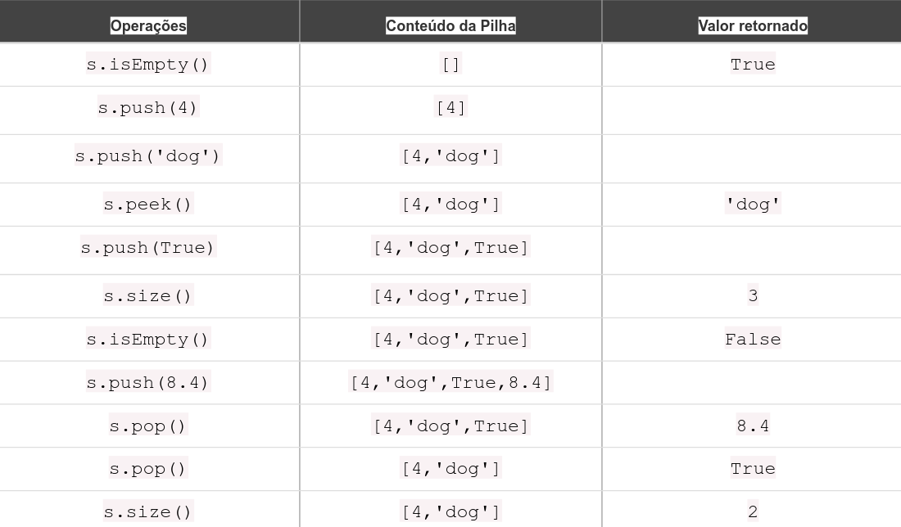

# Pilhas

Até agora estudamos a manipulação dos arrays, um tipo de estrutura de utilização genérica comum na computação. Como você aprendeu, podemos adicionar e remover elementos de um array em qualquer índice desejado. No entanto, às vezes precisamos de uma forma de estrutura de dados onde tenhamos mais controle sobre a adição e remoção de itens. 

Existem algumas estruturas de dados que possuem algumas semelhanças com os arrays, mas que nos dão mais controle sobre a adição e remoção de elementos. Uma delas é a Pilha.

Esta estrutura recebeu este nome pois se comporta da mesma forma que uma pilha de itens, como pilha de roupas ou de pratos.


## Definição

Uma pilha (stack) é uma estrutura de dados muito comum que segue o princípio LIFO (Last In, First Out), ou seja, o último elemento adicionado à pilha é o primeiro a ser removido. Podemos imaginar uma pilha como uma pilha de pratos: o último prato colocado no topo da pilha é o primeiro a ser retirado.


Podemos fazer algumas considerações sobre os elementos:
- Itens mais perto da base são aqueles que estão na pilha a mais tempo;
- Itens inseridos recentemente estão mais perto do topo; 
- O último item inserido é aquele que está na posição em que pode ser removido primeiro;

## Casos de uso

Pilhas são muito úteis em várias situações. Aqui estão alguns exemplos:

- O sistema operacional armazena a chamada em uma pilha na memória quando estamos fazendo uso funções que executam outras funções. Assim que as instruções return são encontradas, as funções devolvem o valor e, são desempilhadas da memória. Veja o exemplo a seguir de uma função recursiva: Uma função que chama a si, enquanto não chegar à condição de parada, terá a execução armazenada em uma pilha de chamadas (call stack).

<div style="text-align: center; margin: 1rem">

</div>

- À medida que você navega de uma página web para outra página, a url das páginas são colocadas em uma pilha. A página atual está no topo e a primeira página que você olhou está na base. Se você clicar no botão Voltar, você começa a se mover pelas páginas na ordem inversa.

- Em um editor de texto a pilha é utilizada para armazenar as versões digitadas. Ao realizar uma nova inserção de texto, o novo texto pode ser empilhado. Para desfazer a edição e retornar ao último estado basta desempilhadar a pilha.

<div style="text-align: center; margin: 1rem">

</div>

- Expressões Matemáticas (Conversão e Avaliação): Pilhas são amplamente utilizadas em algoritmos que convertem ou avaliam expressões matemáticas. 
  - Podemos utilizar as pilhas para avaliar os balanceamento de parenteses 
  - Conversão de números entre diferentes bases numéricas.
  - Avaliações de expressões infixas, prefixas e posfixas
  - Reversão de informações

## Operações

O tipo abstrato de dados pilha é definido pelas seguintes operações

- push: Adiciona um elemento no topo da pilha.
- pop: Remove o elemento do topo da pilha.
- peek (ou Top): Olha o elemento do topo sem removê-lo.
- isEmpty: Verifica se a pilha está vazia.
- size: Retorna o tamanho da pilha.

Essas operações são básicas e permitem manipular dados de forma simples, mas eficaz.

## Implementações

A pilha pode ser implementada de várias formas em JavaScript, como com arrays, objetos e classes. 

### Implementação Estática com Arrays

Em JavaScript, os arrays podem ser facilmente usados para implementar uma pilha, pois eles já têm métodos como push() e pop().


```js
let stack = [];

// Adicionando elementos na pilha (push)
stack.push(1);
stack.push(2);
stack.push(3);

console.log(stack);  // Output: [1, 2, 3]

// Removendo o último elemento da pilha (pop)
let lastItem = stack.pop();
console.log(lastItem);  // Output: 3
console.log(stack);     // Output: [1, 2]

// Ver o elemento do topo da pilha (peek)
let topItem = stack[stack.length - 1];
console.log(topItem);   // Output: 2

```


### Utilizando com Classes

Agora, vamos utilizar classes para ter mais controle sobre a estrutura de dados e facilitar sua reutilização.


```js
class Stack {
  constructor() {
    this.items = [];
  }

  // Adicionar item à pilha (push)
  push(element) {
    this.items.push(element);
  }

  // Remover o último item da pilha (pop)
  pop() {
    if (this.isEmpty()) {
      return 'Stack is empty';
    }
    return this.items.pop();
  }

  // Ver o último item sem remover (peek)
  peek() {
    if (this.isEmpty()) {
      return 'Stack is empty';
    }
    return this.items[this.items.length - 1];
  }

  // Verificar se a pilha está vazia
  isEmpty() {
    return this.items.length === 0;
  }

  // Ver o tamanho da pilha
  size() {
    return this.items.length;
  }

  // Limpar a pilha
  clear() {
    this.items = [];
  }
}

const stack = new Stack();
stack.push(10);
stack.push(20);
stack.push(30);

console.log(stack.peek());  // Output: 30
console.log(stack.pop());   // Output: 30
console.log(stack.size());  // Output: 2

```
### Utilizando as operações

Podemos utilizar as operações implementadas da Stack para testar o funcionamento da nossa pilha. Realize as chamadas dos métodos do quadro a seguir:




### Complexidade de Tempo

- push: O tempo para adicionar um elemento na pilha é O(1).
- pop: O tempo para remover um elemento do topo da pilha também é O(1).
- peek: Visualizar o elemento no topo da pilha é O(1).
- isEmpty:


As operações mais comuns são push, pop, peek, isEmpty e size.
Você pode implementar uma pilha de maneira simples usando arrays ou criando uma classe em JavaScript para personalizar suas funcionalidades.


## Resolvendo problemas usando pilhas

Pilhas têm uma variedade de aplicações em problemas do mundo real. Elas podem ser usadas em problemas de retrocesso (backtracking) para lembrar tarefas ou caminhos visitados, e para desfazer ações (aprenderemos como aplicar esse exemplo quando discutirmos grafos e problemas de retrocesso mais adiante). 

As linguagens de programação usam pilhas para armazenar variáveis e chamadas de métodos, e há uma exceção de estouro de pilha (stack overflow) que pode ser lançada especialmente ao trabalhar com algoritmos recursivos.

Agora que sabemos como usar uma Pilha, vamos utilizá-la para resolver alguns problemas. Nesta seção, aprenderemos os três exemplos de algoritmos mais famosos que utilizam uma pilha. 

- Conversão de decimal para binário
- Balanceamento de parênteses 
- Torre de Hanói usando pilhas

### Decimal para binário

Você provavelmente já está familiarizado com a base decimal. No entanto, a representação binária é muito importante na Ciência da Computação, pois tudo em um computador é representado por dígitos binários (0 e 1). Sem a capacidade de converter de decimal para binário e vice-versa, seria um pouco difícil se comunicar com um computador.

Para converter um número decimal em uma representação binária, podemos dividir o número por 2 (binário é um sistema numérico de base 2) até que o resultado da divisão seja 0. Como exemplo, vamos converter o número 10 em dígitos binários:
Essa conversão é uma das primeiras coisas que você aprende na faculdade (nas aulas de Ciência da Computação). A seguir está o nosso algoritmo:


```js
function divideBy2(decNumber){
  const restoStack = new Stack()
  let resto, binaryString = ''

  while (decNumber > 0){ 
    resto = parseInt(decNumber % 2)
    restoStack.push(resto) 
    decNumber = parseInt(decNumber / 2)
  }
  while (!restoStack.isEmpty())
    binaryString += restoStack.pop().toString()
  }
  return binaryString;
 }
```


Podemos facilmente modificar o algoritmo anterior para que funcione como um conversor de decimal para qualquer base. Em vez de dividir o número decimal por 2, podemos passar a base desejada como um argumento para o método e usá-la nas divisões, conforme mostrado no algoritmo a seguir:

```js
 function baseConverter(decNumber, base){
  var remStack = new Stack(),
  rem,
  baseString = '',
  digits = '0123456789ABCDEF'; //{6}
  while (decNumber > 0){
    rem = Math.floor(decNumber % base);
    remStack.push(rem);
    decNumber = Math.floor(decNumber / base);
  }
  while (!remStack.isEmpty()){
    baseString += digits[remStack.pop()]; //{7}
  }
  return baseString;
 }
 ```

 ### Balanceamento de Parenteses

 ### Torre de Hanoi