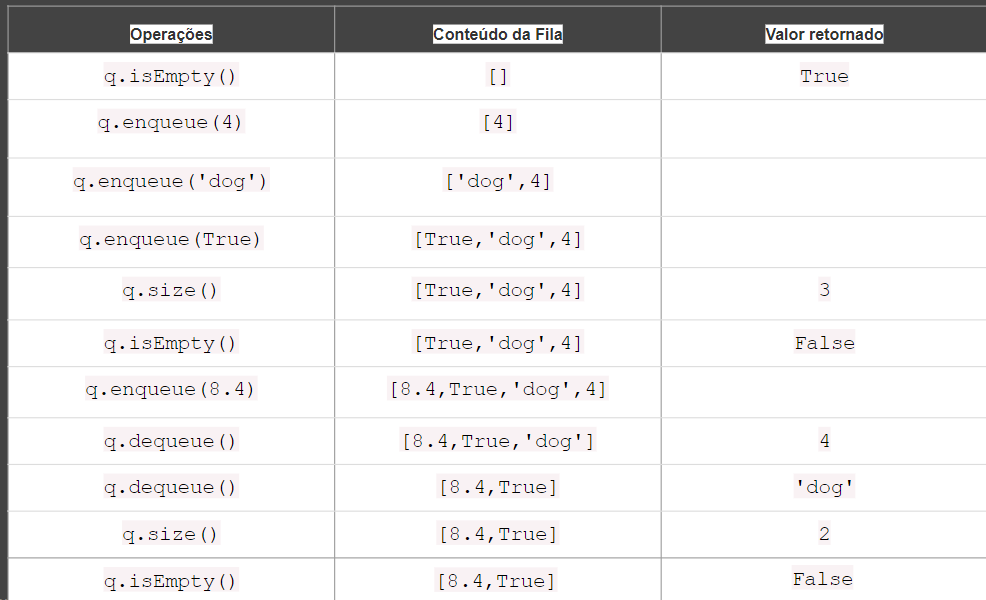
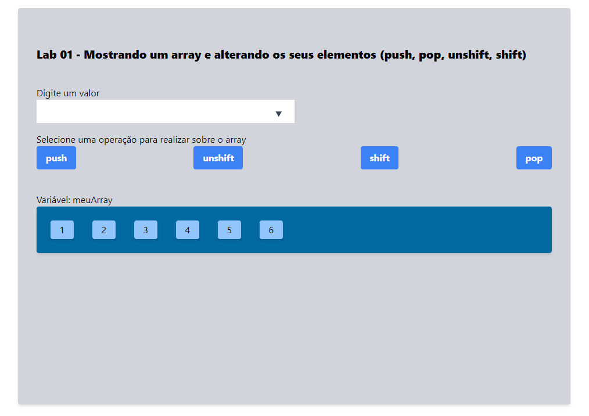
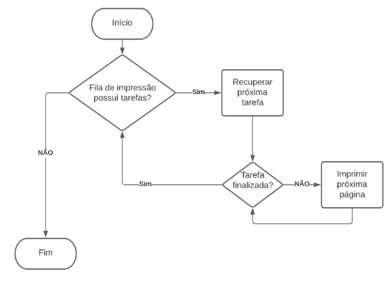

# Fila

A fila (queue - kyo͞o ) é uma estrutura estremamente importante e comum no nosso dia-a-dia. Elas determinam a ordem de atendimento/processamento em diversas situações, nos meios digitais e no cotidiano das pessoas. 

Em uma fila as pessoas são atendidas conforme a posição em que elas chegaram na fila. Aquele a ser atendido é o primeiro da fila. Quando o primeiro da fila é chamado, a fila  "anda", ou seja, o segundo passa a ser o primeiro, o terceiro passa a ser o segundo e assim por diante até a última pessoa.

Normalmente, para entrar em uma fila, uma pessoa deve se colocar na última posição, ou seja, no fim da fila. Desta forma, quem chega primeiro tem preferencia.

## Definição

A fila é uma coleção ordenada de itens que segue o princípio FIFO (First In First Out), também conhecido como o princípio de primeiro a entrar, primeiro a sair. A adição de novos elementos em uma fila ocorre na cauda (rear), e a remoção é feita pela frente. O elemento mais recente adicionado à fila deve esperar no final da fila. 


## Casos de uso
Alguns exemplos que vivenciamos no cotidiano são as filas para o cinema, para a cafeteria e a fila do caixa em um supermercado. 

<div style="text-align: center; margin: 1rem">

</div>

Um exemplo muito popular na informática é a fila de impressão. Suponha que precisamos imprimir cinco documentos. Abrimos cada documento e clicamos no botão de imprimir. Cada documento será enviado para a fila de impressão. O primeiro documento que pedimos para ser impresso será o primeiro a ser impresso, e assim por diante, até que todos os documentos sejam impressos.

<div style="text-align: center; margin: 1rem ">

</div>


A unidade de controle (UC) de uma  CPU controla a fila de processos que desejam acessar a unidade lógico aritmética (ULA). Diversos tipos de fila podem ser utilizadas, uma estratégia comum é a fila com prioridades, fazendo com que a movimentação dos elementos seja guiada de acordo com os algoritmos de cada fila


As operações de enfileirar e desenfileirar permanecem da mesma forma: Primeiro processo a entrar na fila deverá ser o primeiro a sair para ser executado pela ULA.

<div style="text-align: center; margin: 1rem">

</div>


 
Um pacote na fila de comunicação em redes de computadores é colocado na fila ao chegar em dispositivos de comutação para que ela seja roteado para o destino. Cada pacote é processado e enfileirado para a saída correta
Quando a demanda de um roteador é muito grande ele pode eliminar os últimos pacotes que chegaram a fila por um processo de Drop Tail


<div style="text-align: center; margin: 1rem">

</div>

O Windows armazena os dados de operações de leitura e escrita de arquivos em buffers de dados, mantidos pelo sistema para otimizar o desempenho do disco. Quando um aplicativo grava em um arquivo, o sistema geralmente armazena os dados em buffer e os grava no disco regularmente. Esse armazenamento em buffer para gravação de dados em dispositivos de memória secundária também pode ser feito com filas. 

## Operações

 O tipo abstrato de dados fila é definido pelas seguintes operações

- enqueue (inserir): Adiciona um elemento no final da fila.
- dequeue (remover): Remove o elemento da frente da fila.
- front: Verifica o elemento na frente da fila sem removê-lo.
- rear: Verifica o último elemento na fila, sem removê-lo
- isEmpty: Verifica se a fila está vazia
- size: Verifica o tamanho da fila


 
### Utilizando as operações 

Podemos utilizar as operações implementadas para testar o funcionamento da nossa fila. Para as diferentes implementações vistas anteriormente realize as chamadas dos métodos do quadro a seguir:



Inicialmente utilize o [lab1](./labs/lab1/) para aplicar as operações de uma fila usando os métodos push e shift do array javascript. Em seguida, faça a implementação e utilize as chamadas dos métodos em uma pequena aplicação.



## Implementação


A fila pode ser implementada de várias formas em JavaScript, como com arrays, objetos, ou classes.

### Implementação com Arrays

Em JavaScript, os arrays podem ser facilmente usados para implementar uma fila, pois eles já têm métodos como push() que insere um elemento na última posição e o shift() que remove um elemento da primeira posição.

```js
const items = []

function enqueue(element){
    items.push(element)
}

function dequeue(){
    return items.shift()
}

function size(){
    return items.length
}

function isEmpty(){
    return items.length === 0
}

function front(){
    return isEmpty()? null: items[0]
}

function rear(){
    return isEmpty()? null: items[size()-1]
}

export {enqueue, dequeue, size, isEmpty, front, rear}

```

### Implementação com Classe

Vamos  implementar a fila usando uma classe.

Arquivo class-queue.js
```js
// Implementação de uma classe Fila (Queue)
class Queue {
    constructor(){
        this.items = []
    }
    // Método para adicionar um elemento na fila 
    enqueue(element){
        this.items.push(element)
    }
    // Método para remover o elemento da frente da fila
    dequeue(){
        if (this.isEmpty()){
            return "A fila está vazia"
        }
        return this.items.shift()
    }
    // Método para verificar o tamanho da fila
    size(){
        return this.items.length
    }
    // Método para verificar se a fila está vazia
    isEmpty(){
        return this.items.length === 0
    }
    // Método para ver o elemento na frente da fila
    front(){
        return this.isEmpty()? "A fila está vazia": items[0]
    }
    // Método para ver o elemento no final da fila
    rear(){
        return this.isEmpty()? "A fila está vazia": items[size()-1]
    }
    // Método para limpar a fila
    clear() {
        this.items = []; // Limpa o array, removendo todos os elementos
    }
}

export {Queue}
```
Arquivo app.js
```js
import {Queue} from "./class-queue.js"

const q = new Queue()

let valor_retornado = q.isEmpty()
console.log(valor_retornado)

q.enqueue(4)
q.enqueue("dog")
q.enqueue(true)

valor_retornado = q.size()
console.log(valor_retornado)

valor_retornado = q.isEmpty()
console.log(valor_retornado)

q.enqueue(8.4)

valor_retornado = q.dequeue()
console.log(valor_retornado)

valor_retornado = q.dequeue()
console.log(valor_retornado)

valor_retornado = q.size()
console.log(valor_retornado)

valor_retornado = q.isEmpty()
console.log(valor_retornado)

```

## Complexidade de Tempo:
enqueue: O tempo de inserção é O(1), pois estamos apenas adicionando ao final da fila.
dequeue: O tempo de remoção é O(n), pois shift() precisa reorganizar os índices do array após a remoção.
peek e isEmpty: Ambas as operações têm tempo O(1).


## Fila de prioridade  

As filas são amplamente aplicadas na Ciência da Computação e também em nossas vidas, existem algumas versões modificadas da fila padrão que implementamos no tópico anterior. Uma versão modificada é a fila de prioridade. Os elementos são adicionados e removidos com base em uma prioridade. Um exemplo da vida real é a fila de embarque no aeroporto. Os passageiros da primeira classe e da classe executiva têm prioridade sobre os passageiros da classe econômica. 

Há situações em que pessoas idosas e mulheres grávidas (ou mulheres com recém-nascidos) também têm prioridades.  
Outro exemplo da vida real é a sala de espera de pacientes em um hospital (emergência). Pacientes em estado grave são atendidos por um médico antes dos pacientes em condições menos graves. Normalmente, uma enfermeira fará a triagem e atribuirá um código ao paciente, dependendo da gravidade da condição.  
Existem duas opções ao implementar uma fila de prioridade: você pode definir a prioridade e adicionar o elemento na posição correta, ou pode enfileirar os elementos à medida que são adicionados à fila e removê-los de acordo com a prioridade. Para este exemplo, adicionaremos os elementos em sua posição correta, para que possamos removê-los por padrão:"


```js
// Classe que representa um nó na fila de prioridade
class Node {
  constructor(value, priority) {
    this.value = value;       // Valor do nó
    this.priority = priority; // Prioridade do nó
  }
}

// Classe que representa a fila de prioridade
class PriorityQueue {
  constructor() {
    this.items = []; // Array para armazenar os nós
  }

  // Método para adicionar um elemento na fila com uma prioridade
  enqueue(value, priority) {
    const newNode = new Node(value, priority);

    // Se a fila estiver vazia, simplesmente adiciona o novo nó
    if (this.isEmpty()) {
      this.items.push(newNode);
    } else {
      // Encontra a posição correta para inserir o novo nó com base na prioridade
      let added = false;
      for (let i = 0; i < this.items.length; i++) {
        // Se a prioridade do novo nó for maior que a do nó atual
        if (newNode.priority > this.items[i].priority) {
          this.items.splice(i, 0, newNode); // Insere na posição correta
          added = true;
          break;
        }
      }
      // Se o nó não foi adicionado, significa que ele tem a menor prioridade
      if (!added) {
        this.items.push(newNode); // Adiciona no final da fila
      }
    }
  }

  // Método para remover o elemento com a maior prioridade
  dequeue() {
    if (this.isEmpty()) {
      return 'A fila está vazia'; // Não há nada para remover
    }
    return this.items.shift(); // Remove e retorna o primeiro nó
  }

  // Método para ver o primeiro elemento da fila (peek)
  peek() {
    if (this.isEmpty()) {
      return 'A fila está vazia';
    }
    return this.items[0]; // Retorna o nó com maior prioridade
  }

  // Método para verificar se a fila está vazia
  isEmpty() {
    return this.items.length === 0;
  }

  // Método para verificar o tamanho da fila
  size() {
    return this.items.length;
  }

  // Método para limpar a fila
  clear() {
    this.items = [];
  }
}

// Exemplo de uso da Fila de Prioridade
const filaPrioridade = new PriorityQueue();

// Adicionando elementos com prioridade
filaPrioridade.enqueue('Paciente A', 2); // Prioridade 2
filaPrioridade.enqueue('Paciente B', 5); // Prioridade 5
filaPrioridade.enqueue('Paciente C', 1); // Prioridade 1
filaPrioridade.enqueue('Paciente D', 3); // Prioridade 3

console.log(filaPrioridade.peek()); // Output: { value: 'Paciente B', priority: 5 }
console.log(filaPrioridade.dequeue()); // Output: { value: 'Paciente B', priority: 5 }
console.log(filaPrioridade.peek()); // Output: { value: 'Paciente D', priority: 3 }
console.log(filaPrioridade.size()); // Output: 3

```

A diferença entre a implementação das classes Queue padrão e PriorityQueue é que precisamos criar um elemento especial (linha {1}) para ser adicionado à PriorityQueue. Este elemento contém o elemento que desejamos adicionar à fila (pode ser de qualquer tipo), além da prioridade na fila.

Primeiro, precisamos comparar sua prioridade com os demais elementos (linha {2}). Quando encontramos um item que tem uma prioridade maior do que o elemento que estamos tentando adicionar, então inserimos o novo elemento uma posição antes (com essa lógica, também respeitamos os outros elementos com a mesma prioridade, mas que foram adicionados à fila primeiro). Para fazer isso, podemos usar o método splice da classe array do JavaScript que você aprendeu no Capítulo 2, Arrays. Uma vez que encontramos um elemento com uma prioridade mais alta, inserimos o novo elemento (linha {3}), e paramos de percorrer a fila (linha {4}). Dessa forma, nossa fila também será organizada e classificada por prioridade.

Além disso, se a prioridade que estamos adicionando for maior do que qualquer prioridade já adicionada, ou se a fila estiver vazia, simplesmente a adicionamos ao final da fila (linha {5}).


## Resolvendo problemas usando pilhas

Uma simulação de impressora é interessante pois nos permite estudar o comportamento de uma fila. Ao passo que usuários enviam um trabalho para uma impressora compartilhada, as tarefas são colocadas em uma fila para serem processadas de maneira que a primeira a chegar seja a primeira a ser atendida.

Vamos definir uma tarefa como sendo a quantidade de páginas de um arquivo e o usuário que a enviou. Também vamos definir uma variável para controlar as páginas impressas. O comportamento de uma tarefa terá a impressão de uma página por vez e a verificação se ela está concluída.

Uma impressora será definida pela quantidade de páginas impressas por minuto (ppm) para que possamos simular a execução. Internamente à impressora temos a fila que controla o funcionamento. Vamos definir a classe Printer com um construtor com ppm com parâmetros e a definição de tarefas atuais (currentTask) e fila de impressão (printQueue)

- O método chamado addTask deve adicionar uma tarefa para a impressora. O atributo printQueue para enfileirar o trabalho na fila. 

- O método principal desta simulação está no algoritmo que consulta a fila de impressão e imprime cada página de cada tarefa até ela ser finalizada.

- O método printTasks na classe Printer tem o comportamento do algoritmo descrito no fluxograma. No seu algoritmo, enquanto a fila não estiver vazia, desempilhe cada tarefa e execute método printPage enquanto a tarefa não estiver concluída.



```js
import {Queue} from "./linked-queue.js"

class Task {
    constructor(pages, user) {
      this.user = user
      this.pages = pages
      this.printedPages = 0
    }
    printPage(){
      this.printedPages += 1
    }
    isDone(){
      return this.printedPages === this.pages
    }
    toString(){
      return `${this.printedPages}/${this.pages} - ${this.user}`
    }
  }

class Printer {
  constructor(ppm) {
    this.pageRate = ppm
    this.currentTask = null
    this.printQueue = new Queue()
  }

  addTask(task){
    this.printQueue.enqueue(task)
  }
  printTasks(){
    while (!this.printQueue.isEmpty()) {
        console.log(this.printQueue.size())
        let task = this.printQueue.dequeue()
        while(!task.isDone()) {
            task.printPage()
            console.log(task)
        }
    }
  }
}

export {Printer, Task}
```

Podemos criar um objeto printer e adicionar tarefas à ele. Após isso vamos iniciar a simulação.

```js
import {Printer, Task} from "./printer.js"
const printer = new Printer(30)
printer.addTask(new Task(3,"Romulo"))
printer.addTask(new Task(1,"Maria"))
printer.addTask(new Task(10,"Joao"))
printer.addTask(new Task(2,"Pedro"))
printer.printTasks()
```


## Projetos

- Criar uma aplicação de página única que permita realizar todas as operacoes de fila (items/enqueue/dequeue/front)


- Criar uma aplicação com fila de atendimento prioritário. 

Uma fila prioritária possui uma mudança no comportamento de **enfileirar (enqueue)**. Ao enfileirar um novo item na fila ele deverá ser incluído na última posição conforme sua prioridade. Os outros itens devem ser realocados uma posição atrás.


- Multiplas filas para chamar em concurso

Em concursos públicos, a convocação de candidatos geralmente obedece a uma ordem de classificação, que pode variar de acordo com cotas específicas e reservas legais de vagas, como para candidatos negros (20%), pessoas com deficiência (PcD) (5%) e o público em geral. 

A convocação é feita alternadamente: chamam-se candidatos da ampla concorrência, depois das cotas raciais e, em seguida, da cota de PcD, seguindo a proporcionalidade exigida até o preenchimento das vagas.

A cada 5 de ampla concorrência, deve-se chamar um candidato das cotas para candidatos negros. A cada 20 candidatos chamados, deve-se chamar 1 candidato das contas para PcD

- Fila circular
