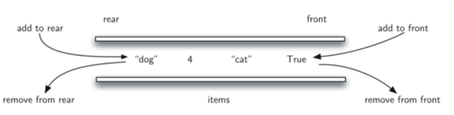
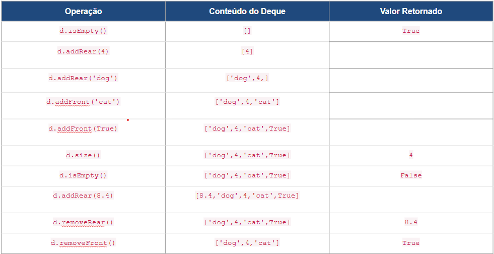
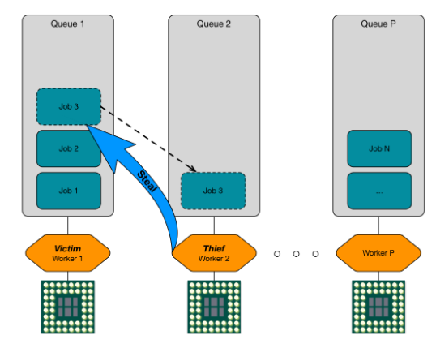
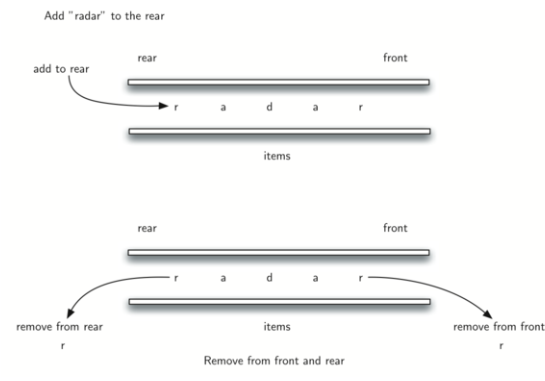

# Deque

Um Deque, também é conhecida como fila de duas extremidades (double-ended queue), é uma coleção ordenada de itens semelhantes à fila.  O comportamento de um deque segue os seguintes princípios:
- Novos itens podem ser adicionados no início ou no fim. 
- Itens existentes podem ser removidos de qualquer uma das extremidades. 

        De certa forma, esta estrutura híbrida fornece todas as capacidades de pilhas e filas em uma única estrutura de dados

Embora um deque tenha características de pilhas e filas, os comportamentos LIFO e FIFO não são impostos. Ao desenvolver uma aplicação com essas necessidades o  programador deve fazer uso consistente das operações de inserção e remoção.

## Operações

O tipo de dado abstrato de deque (fila dupla) é definido pela seguinte estrutura e operações. 
- addFront(item) insere um novo item no início do deque. 
- addRear(item) insere um novo item no fim do deque. 
- removeFront() remove e retorna o item do início do deque. 
- removeRear() remove e retorna o item do fim do deque.
- isEmpty() testa se o deque está vazia. 
- size() retorna o número de itens na deque. Não precisa de parâmetros e retorna um inteiro (int).

Uma implementação de deque irá seguir os seguintes comportamentos descritos na tabela a seguir: 

## Aplicações

Um deque pode ser utilizado para substituir a fila em aplicações com comportamentos especiais. Por exemplo, quando uma pessoa com atendimento preferencial necessitar ser atendida primeiro antes dos que estavam já na fila. Embora possam também ser implementadas com as filas prioritárias.

Em escalonadores de computação paralela os deques podem ser utilizados para substituir as filas de processos. Em ambientes com vários processadores as filas de processos podem esvaziar em alguns processadores e continuar longas em outros.

O algoritmo “work stealing” aplicado em um ambiente multithread/multiprocessado irá distribuir processos para processadores que estão ociosos.

Um problema interessante que pode ser facilmente resolvido usando a estrutura de dados deque (fila dupla) é o problema clássico do palíndromo
Um palíndromo é uma string que é lida da mesma forma do início para o fim e do fim para o início, por exemplo, radar, natan e “a base do teto desaba” são palídromos

Vamos processar a string da esquerda para a direita e inserir cada caractere no fim do deque. O início da deque amazenará o primeiro caractere da string e o fim da deque manterá o último caractere. Com a operação de remoção no fim e no ínicio podemos comparar e verificar o palindromo.

