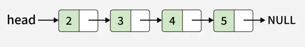
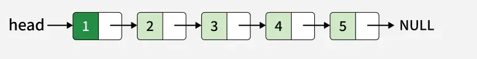
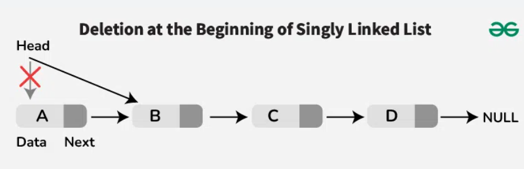
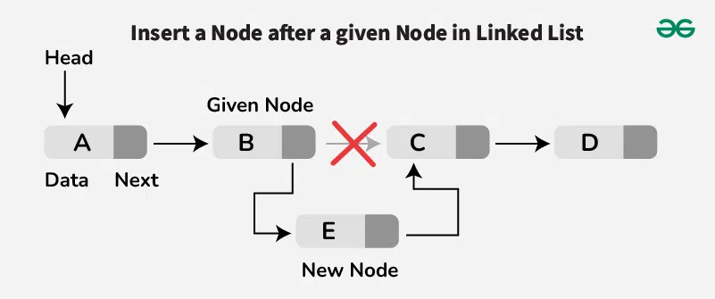
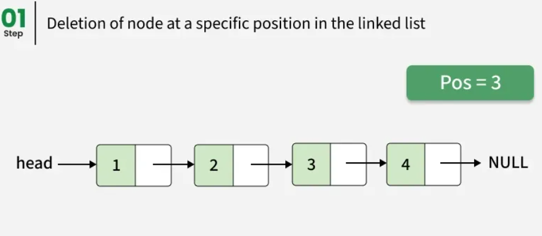
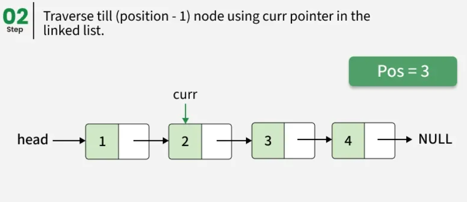
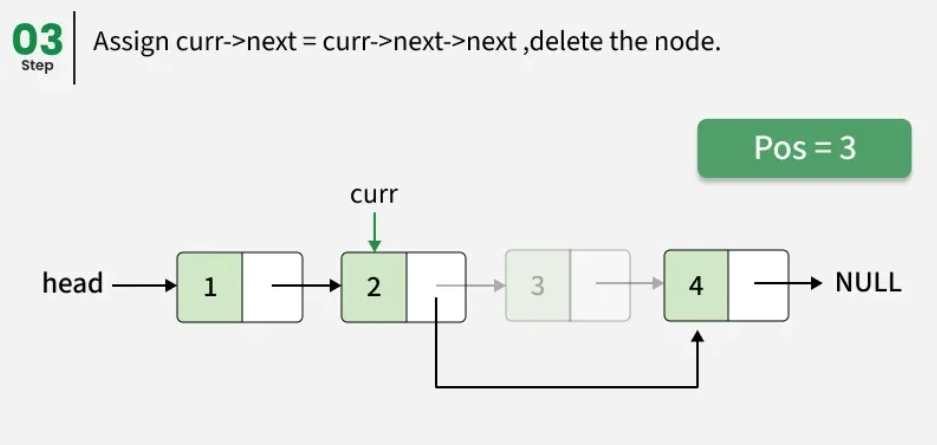
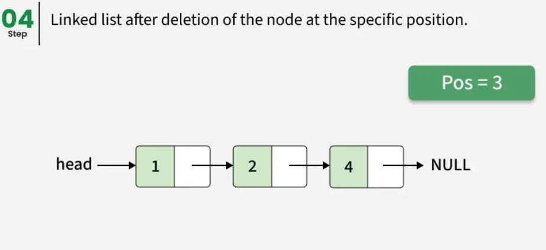

# Listas

As listas são uma das ferramentas de organização mais comuns que as pessoas utilizam no dia a dia. Temos listas de tarefas, listas de compras, listas dos dez melhores, listas dos dez piores e muitos outros tipos. Nossas aplicações no computador também costumam utilizar listas, especialmente quando temos diversos itens para manipular da mesma forma. Elas são especialmente úteis quando não precisamos realizar buscas constantemente nos itens ou organizá-los em algum tipo de ordem específica.

Quando precisamos realizar buscas rápidas, realizar ordenações constantes as listas ou fazer muitas modificações nos elementos centrais as listas se tornam menos úteis. Para estes casos podemos utilizar estruturas como sets, árvores ou deques.

Inicialmente vamos projetar um TAD para uma lista. Desta forma precisamos fornecer as propriedades e as operações que podem ser realizadas sobre ela ou por ela.

## Exemplos no nosso cotidiano

- Redes Sociais (Facebook, Instagram, Twitter, LinkedIn)
    - Lista de amigos/seguidores.
    - Lista de postagens e comentários.
    - Lista de notificações.

- Jogos Online e Aplicativos de Classificação
    - Lista de jogadores online.
    - Lista de pontuações (ranking/leaderboard).
    - Lista de itens coletados pelo jogador.

- Sistemas de Busca (Google, Bing)
    - Listas de resultados de pesquisa.
    - Listas de sugestões automáticas (autocomplete)

## Definição

Uma lista é uma sequência ordenada de dados. Cada item de dado armazenado em uma lista é chamado de elemento. Em JavaScript, os elementos de uma lista podem ser de qualquer tipo de dado. Não há um número predefinido de elementos que podem ser armazenados em uma lista, embora o limite prático seja a quantidade de memória disponível para o programa que está utilizando a lista.

Uma lista sem elementos é chamada de lista vazia. O número de elementos armazenados em uma lista é conhecido como o comprimento da lista. Internamente, esse número é mantido em uma variável chamada listSize.

## Operações

Estas são as operações comuns de uma lista:

- append(element) - Adicionar elementos no final da lista
- insert(position, element) - Inserir elementos em uma posição específica.
- remove(element) - Remover um elemento da lista.
- removeAt(position) - Remover elementos em uma posição específica.
- indexOf(element) - Retorna a posição de um dado elemento
- isEmpty() - Retorna se a lista está vazia
- size() - Retorna o tamanho da lista
- toString() - Retorna a lista como texto
- print() - Imprime os elementos da lista
- clear() - Limpar a lista removendo todos os elementos atuais para torná-la vazia.

Esses conceitos formam a base para o design e a implementação de um ADT de lista em qualquer linguagem de programação.


## Arrays no Javascript e Listas


Cada linguagem possui sua própria implementação de arrays, existem linguagens que implementam arrays com tamanhos fixos (na maioria das linguagens) e linguagens que tratam arrays como objetos (javascript). Os arrays na linguagem javascript são implementados com diversas operações similares às de uma lista. Veja a seguir as operações implementadas pelo tipo [Array](https://developer.mozilla.org/en-US/docs/Web/JavaScript/Reference/Global_Objects/Array)


- [Array.prototype.push()
](https://developer.mozilla.org/pt-BR/docs/Web/JavaScript/Reference/Global_Objects/Array/push) - Adiciona um ou mais elementos ao final de um array e retorna o novo comprimento desse array.
- [Array.prototype.shift()](https://developer.mozilla.org/pt-BR/docs/Web/JavaScript/Reference/Global_Objects/Array/shift) - Remove o primeiro elemento de um array e retorna esse elemento. Este método muda o tamanho do array.
- [Array.prototype.unshift()](https://developer.mozilla.org/pt-BR/docs/Web/JavaScript/Reference/Global_Objects/Array/unshift) - Adiciona um ou mais elementos no início de um array e retorna o número de elementos (propriedade length) atualizado..
- [Array.prototype.splice()](https://developer.mozilla.org/pt-BR/docs/Web/JavaScript/Reference/Global_Objects/Array/splice) - Altera o conteúdo de uma lista, adicionando novos elementos enquanto remove elementos antigos.
- [Array.prototype.length](https://developer.mozilla.org/pt-BR/docs/Web/JavaScript/Reference/Global_Objects/Array/length) - A propriedade length representa um inteiro de 32-bit sem sinal, que especifíca o número de elementos em um array.
- [Array constructor](https://developer.mozilla.org/en-US/docs/Web/JavaScript/Reference/Global_Objects/Array/Array) - Cria um novo array


Embora essa estrutura seja muito conveniente e nos fornece uma sintaxe prática com [] para acessar seus elementos, ela possui desvantagens ao realizar algumas operações, como inserir ou remover itens do início ou do meio do array. Estas operações são consideradas "caras" pois os elementos precisam ser realocados (em outras linguagens) ou os índices precisam ser realocados (em javascript).

## Implementação

A lista pode ser implementada de várias formas em JavaScript, como com arrays, objetos, ou classes.

## Implementação com Arrays


Em JavaScript, os arrays podem ser facilmente usados para implementar uma lista, pois ele já possui diversos métodos para compor as operações. Aqui estamos utilizando nomes das funções mais convencionais para listas

```js
const items = []; // Inicializa a lista como um array vazio

// Adicionar elementos no final da lista
function append(element) {
  items.push(element);
}

// Inserir elementos em uma posição específica
function insert(position, element) {
  if (position >= 0 && position <= items.length) {
    items.splice(position, 0, element);
    return true;
  }
  return false;
}

// Remover um elemento da lista
function remove(element) {
  const index = indexOf(element);
  if (index !== -1) {
    removeAt(index);
    return true;
  }
  return false;
}

// Remover elementos em uma posição específica
function removeAt(position) {
  if (position >= 0 && position < items.length) {
    return items.splice(position, 1)[0];
  }
  return null;
}

// Retorna a posição de um dado elemento
function indexOf(element) {
  return items.indexOf(element);
}

// Retorna se a lista está vazia
function isEmpty() {
  return items.length === 0;
}

// Retorna o tamanho da lista
function size() {
  return items.length;
}

// Retorna a lista como texto
function toString() {
  return items.join(", ");
}

// Imprime os elementos da lista
function print() {
  console.log(toString());
}

// Limpa a lista removendo todos os elementos
function clear() {
  items.length = 0;
}

// Exemplo de uso
append("A");
append("B");
insert(1, "C");
print(); // A, C, B
remove("C");
print(); // A, B
removeAt(0);
print(); // B

``` 


## Implementação com Classes e Arrays


```js
class ArrayList {
  constructor() {
    this.items = []; // Atributo para armazenar os elementos
  }

  // Adicionar elementos no final da lista
  append(element) {
    this.items.push(element);
  }

  // Inserir elementos em uma posição específica
  insert(position, element) {
    if (position >= 0 && position <= this.items.length) {
      this.items.splice(position, 0, element);
      return true;
    }
    return false;
  }

  // Remover um elemento da lista
  remove(element) {
    const index = this.indexOf(element);
    if (index !== -1) {
      this.removeAt(index);
      return true;
    }
    return false;
  }

  // Remover elementos em uma posição específica
  removeAt(position) {
    if (position >= 0 && position < this.items.length) {
      return this.items.splice(position, 1)[0];
    }
    return null;
  }

  // Retorna a posição de um dado elemento
  indexOf(element) {
    return this.items.indexOf(element);
  }

  // Retorna se a lista está vazia
  isEmpty() {
    return this.items.length === 0;
  }

  // Retorna o tamanho da lista
  size() {
    return this.items.length;
  }

  // Retorna a lista como texto
  toString() {
    return this.items.join(", ");
  }

  // Imprime os elementos da lista
  print() {
    console.log(this.toString());
  }

  // Limpa a lista removendo todos os elementos
  clear() {
    this.items = [];
  }
}

// Exemplo de uso
const list = new ArrayList();
list.append("A");
list.append("B");
list.insert(1, "C");
list.print(); // A, C, B
list.remove("C");
list.print(); // A, B
list.removeAt(0);
list.print(); // B

```

## Listas Ligadas

As listas ligadas armazenam uma coleção sequencial de elementos, mas, diferentemente dos arrays contíguos ou dos arrays no javascript (objetos especiais), os elementos nas listas ligadas não estão localizados de forma contígua na memória.

Cada elemento consiste em um nó, que armazena o próprio elemento e também uma referência (também conhecida como ponteiro ou link) que aponta para o próximo elemento. O seguinte diagrama exemplifica a estrutura de uma lista ligada:

<div align="center">
  
</div>

Um dos benefícios de uma lista ligada em comparação a um array convencional é que não precisamos deslocar os elementos ao adicionar ou remover itens. No entanto, esta implementação possui uma passo adicional. Devemos marcar as posições de início e fim com alguma variável a qual chamaremos de ponteiros. 

Outro detalhe é que, em um array, podemos acessar diretamente qualquer elemento em qualquer posição; já em uma lista ligada, se quisermos acessar um elemento do meio, precisamos começar do início (a cabeça da lista) e iterar por ela até encontrar o elemento desejado.

### Exemplos do mundo real

Temos alguns exemplos do mundo real que podem ser representados como uma lista ligada. O primeiro exemplo é uma fila de dança (conga line). Cada pessoa é um elemento, e as mãos representam os ponteiros que conectam a próxima pessoa na fila. Você pode adicionar pessoas à fila — basta encontrar o local onde deseja inseri-las, desconectar a ligação, inserir a nova pessoa e reconectar novamente.

<div align="center">
  
</div>


Outro exemplo seria uma caça ao tesouro. Você tem uma pista, e essa pista é o ponteiro para o local onde encontrará a próxima pista. Com esse vínculo, você vai ao próximo lugar e obtém outra pista que levará à seguinte. A única maneira de obter uma pista no meio da lista é seguindo a lista desde o início (da primeira pista).

<div align="center">
  
</div>


Outro exemplo — que pode ser o mais popular para ilustrar listas ligadas — é o de um trem. Um trem consiste em uma série de veículos (também conhecidos como vagões). Cada vagão está conectado ao outro. Você pode facilmente desacoplar um vagão, mudar sua posição, ou adicioná-lo e removê-lo. A figura a seguir demonstra um trem. Cada vagão é um elemento da lista, e a ligação entre os vagões representa o ponteiro.

<div align="center">
  
</div>


## Implementação Listas Ligadas


Agora apresentamos a estrutura de uma lista ligada, vamos implementá-la no javascript a partir da classe a seguir. Observe que além da classe LinkedList vamos criar uma classe Node que representa um elemento da lista (conteúdo do item e próximo).

Considerando as operações para uma lista ligada, a base de código a seguir e as ilustrações faça as sequência passos com descrições visuais, pseudocódigo e a implementação. Lembre de fazer a verificação se a lista estiver vazia ou se as posições indicadas estão adequadas levando em consideração o estado atual da lista. 


```js
class Node {
    constructor(element, next = null) {
        this.element = element
        this.next = next
    }
}
class LinkedList {
    constructor(){
        this.head = null
        this._size = 0
    }
    append(element){}
    insert(position, element) {}
    remove(element){}
    removeAt(position){}
    indexOf(element){}
    toString(){}
    size(){}
    isEmpty(){}
    clear(){}
}
```

Operações:

- append (inserir no fim)
- insert e remove no início da lista
- insert e remove no meio da lista necessita reposicionar os apontadores

### Append (inserir no fim)
A operação de append necessita percorrer todos os elementos da lista e adicionar o novo nó ao chegar no último elemento (aquele que não está ligado a mais nenhum).


### Insert no Início

A partir da lista da imagem a seguir devemos inserir o valor "1" na posição "0". As imagens a seguir refletem o estado da lista antes e depois:

Antes



Depois




### Remover no Início

A remoção no início da lista deve ser efetivada ao alterar apenas a indicação do HEAD para o próximo.




### Insert em posição específica

Para inserir em uma posição central, não sendo na posição 0 e não sendo na última (append), devemos localizar o nó naquela posição e refazer a ligação para o novo nó com o valor a ser inserido e refazer a ligação.
Observe a imagem para inserir o valor "E" na posição "2":




- Dado uma lista ligada, desenhe as etapas, descreva o algoritmo e escreva o código para fazer o insert do valor "Z" na posição "04" para a lista contendo A->B->E->C->D.

### Remove em posição específica

A remoção em uma posição específica em uma lista encadeada envolve a remoção de um nó de um índice/posição específico, que pode ser o primeiro, o nó do meio ou o último nó.

Início com lista contendo valores 01->02->03->04 e removendo valor 03 (pos 02)



Travessia até a posição anterior (pos 02)



Religação dos aponteadores



Estado final da lista




### Código Final

```js
export class Node {
    constructor(element, next = null) {
        this.element = element
        this.next = next
    }

    toString(){
        return this.next!==null
        ?  this.element + " -> " + this.next.toString()
        : this.element
    }
}

export class LinkedList {
    constructor(){
        this.head = null
        this._size = 0
    }

    /**
     * Inserir um novo elemento no final da lista
     */
    append(element){
        const node = new Node(element)
        if (this.isEmpty()) {
            this.head = node
        } else {
            let current = this.head
            while (current.next !== null) {
                current = current.next
            }
            current.next = node
        }
        this._size++
    }

    /**
     * Insere um elemento em uma dada posição
     */
    insert(position, element) {
        const node = new Node(element)
        if (position === 0) {
            node.next = this.head
            this.head = node
            this._size++
        } else if (position > 0 && position <= this.size()) {
            let pos = 0
            let current = this.head
            let previous = null
            while (pos < position) {
                previous = current
                current = current.next
                pos++
            }

            previous.next = node
            node.next = current
            this._size++
        }

    }

    /**
     * Remover um dado elemento
     */
    remove(element){
        const pos = this.indexOf(element)
        if (pos < 0) {
            this.removeAt(pos)
        }
    }

    /**
     * Remover um elemento dada uma posição
     */
    removeAt(position){
        if (position >= this.size()) {
            console.log(`Posição inválida. Escolha o intervalo de 0 até ${this.size() - 1}`)
            return
        }

        if (position == 0) {
            this.head = this.head.next
            this._size--
        } else if (position > 0  && position < this.size()) {
            let pos = 0
            let current = this.head
            while(pos < position - 1){
                current = current.next
                pos++
            } 
            current.next = current.next.next
            this._size--
        }
    }

    /**
     * Informa a posição de um dado elemento na lista
     */
    indexOf(element){
        if (this.size() > 0) {
            let pos = 0
            let current = this.head
            while (current.next !== null) {
                if (current.element == element) {
                    return pos
                }
                pos++
                current = current.next
            }
        }
        return -1
    }

    /**
     * Imprimir todos os nós até chegar no final da lista
     */
    toString(){
        if (this.size () === 0) {
            return "Lista vazia"
        }
        return this.head.toString()

    }

    /**
     * Retornar a quantidade de elementos na lista
     */
    size(){
        return this._size
    }

    /**
     * Informa se a lista está vazia
     */
    isEmpty(){
        return this.size() === 0
    }

    /**
     * Reinicia a lista removendo os seus elementos
     */
    clear(){
        this.head = null
        this._size = 0
    }


}


```

# Exercícios

1. Dadas duas listas encadeadas simples, o objetivo é determinar se elas são idênticas ou não. Duas listas encadeadas são consideradas idênticas se contiverem os mesmos dados na mesma ordem. Se as listas encadeadas forem idênticas, retorne verdadeiro; caso contrário, retorne falso.

    - Input: LinkedList1: 1->2->3->4->5->6, LinkedList2: 99->59->42->20
      
      Output: false
    - Input: LinkedList1: 1->2->3->4->5, LinkedList2: 1->2->3->4->5
      
      Output: true

2. Dado o primeiro nó de uma lista simplesmente encadeada, encontre o nó do meio da lista.

    - Se o número de nós for ímpar, retorne o nó do meio.

    - Se o número de nós for par, existem dois nós do meio, então retorne o segundo nó do meio.

3. Dada uma lista simplesmente encadeada, a partir do segundo nó, remova todos os nós alternados. Por exemplo, se a lista encadeada for 1->2->3->4->5, sua função deve convertê-la para 1->3->5, e se a lista encadeada for 1->2->3->4, converta-a para 1->3.

4. Dada uma lista ligada ordenada em ordem não decrescente, retorne a lista removendo os nós duplicados. A lista retornada também deve estar em ordem não decrescente.

    - Input : Linked List = 11->11->11->21->43->43->60
      
      Output : 11->21->43->60

    - Input : Linked List = 5->10->10->20
      
      Output : 5->10->20 

5. Detectando Loops: Dado o primeiro nó de uma lista simplesmente encadeada, determine se a lista contém um ciclo. Um ciclo existe se, ao percorrer a lista usando os ponteiros `next`, você encontrar um nó que já foi visitado em vez de eventualmente chegar a `null`.

# Referencias

https://www.geeksforgeeks.org/dsa/introduction-to-singly-linked-list/