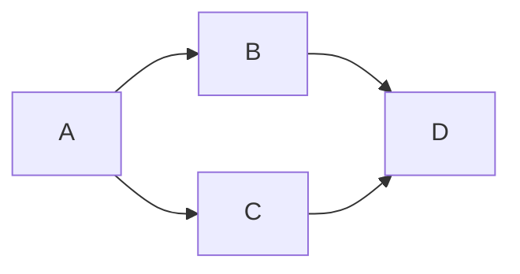

# Listas

As listas são uma das ferramentas de organização mais comuns que as pessoas utilizam no dia a dia. Temos listas de tarefas, listas de compras, listas dos dez melhores, listas dos dez piores e muitos outros tipos. Nossos programas de computador também podem usar listas, especialmente quando temos apenas alguns itens para armazenar nessa forma. Elas são especialmente úteis quando não precisamos realizar buscas nos itens da lista ou organizá-los em algum tipo de ordem específica.
Quando precisamos realizar buscas longas ou ordenações complexas, as listas se tornam menos úteis, especialmente ao lidarmos com estruturas de dados mais complexas.

Para projetar um TAD para uma lista precisamos fornecer uma definição: propriedades e as operações que podem ser realizadas sobre ela ou por ela.

## Definição

Uma lista é uma sequência ordenada de dados. Cada item de dado armazenado em uma lista é chamado de elemento. Em JavaScript, os elementos de uma lista podem ser de qualquer tipo de dado. Não há um número predefinido de elementos que podem ser armazenados em uma lista, embora o limite prático seja a quantidade de memória disponível para o programa que está utilizando a lista.

Uma lista sem elementos é chamada de lista vazia. O número de elementos armazenados em uma lista é conhecido como o comprimento da lista. Internamente, esse número é mantido em uma variável chamada listSize.

Estas são as operações comuns de uma lista:

- Adicionar elementos no final da lista (operação de append).
- Adicionar elementos no início da lista.
- Inserir elementos em uma posição específica.
- Remover elementos.
- Limpar a lista: removendo todos os elementos atuais para torná-la vazia.

Esses conceitos formam a base para o design e a implementação de um ADT de lista em qualquer linguagem de programação.

## Arrays e Listas

Os arrays na linguagem javascript são implementados com operações de listas. Cada linguagem possui sua própria implementação de arrays, existem linguagens que implementam arrays com tamanhos fixos (na maioria das linguagens). 

Embora essa estrutura seja muito conveniente e nos fornece uma sintaxe prática com [] para acessar seus elementos, ela possui desvantagens ao realizar algumas operações, como inserir ou remover itens do início ou do meio do array. Estas operações são consideradas "caras" pois os elementos precisam ser realocados (em outras linguagens) ou os índices precisam ser realocados (em javascript).

## Listas Ligadas

As listas ligadas armazenam uma coleção sequencial de elementos, mas, diferentemente dos arrays, os elementos nas listas ligadas não estão localizados de forma contígua na memória.

Cada elemento consiste em um nó, que armazena o próprio elemento e também uma referência (também conhecida como ponteiro ou link) que aponta para o próximo elemento.

O seguinte diagrama exemplifica a estrutura de uma lista ligada:

