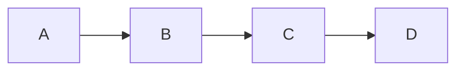
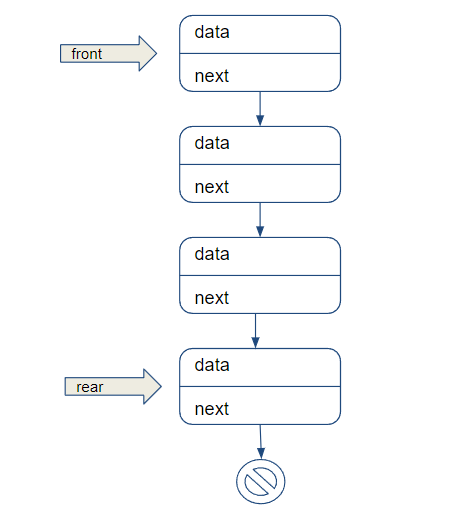

# Listas

As listas são uma das ferramentas de organização mais comuns que as pessoas utilizam no dia a dia. Temos listas de tarefas, listas de compras, listas dos dez melhores, listas dos dez piores e muitos outros tipos. Nossos programas de computador também podem usar listas, especialmente quando temos apenas alguns itens para armazenar nessa forma. Elas são especialmente úteis quando não precisamos realizar buscas nos itens da lista ou organizá-los em algum tipo de ordem específica.
Quando precisamos realizar buscas longas ou ordenações complexas, as listas se tornam menos úteis, especialmente ao lidarmos com estruturas de dados mais complexas.

Para projetar um TAD para uma lista precisamos fornecer uma definição: propriedades e as operações que podem ser realizadas sobre ela ou por ela.

## Definição

Uma lista é uma sequência ordenada de dados. Cada item de dado armazenado em uma lista é chamado de elemento. Em JavaScript, os elementos de uma lista podem ser de qualquer tipo de dado. Não há um número predefinido de elementos que podem ser armazenados em uma lista, embora o limite prático seja a quantidade de memória disponível para o programa que está utilizando a lista.

Uma lista sem elementos é chamada de lista vazia. O número de elementos armazenados em uma lista é conhecido como o comprimento da lista. Internamente, esse número é mantido em uma variável chamada listSize.

Estas são as operações comuns de uma lista:

- Adicionar elementos no final da lista (operação de append).
- Adicionar elementos no início da lista.
- Inserir elementos em uma posição específica.
- Remover elementos.
- Limpar a lista: removendo todos os elementos atuais para torná-la vazia.

Esses conceitos formam a base para o design e a implementação de um ADT de lista em qualquer linguagem de programação.

## Arrays e Listas

Os arrays na linguagem javascript são implementados com operações de listas. Cada linguagem possui sua própria implementação de arrays, existem linguagens que implementam arrays com tamanhos fixos (na maioria das linguagens). 

Embora essa estrutura seja muito conveniente e nos fornece uma sintaxe prática com [] para acessar seus elementos, ela possui desvantagens ao realizar algumas operações, como inserir ou remover itens do início ou do meio do array. Estas operações são consideradas "caras" pois os elementos precisam ser realocados (em outras linguagens) ou os índices precisam ser realocados (em javascript).


## Listas Ligadas

As listas ligadas armazenam uma coleção sequencial de elementos, mas, diferentemente dos arrays, os elementos nas listas ligadas não estão localizados de forma contígua na memória.

Cada elemento consiste em um nó, que armazena o próprio elemento e também uma referência (também conhecida como ponteiro ou link) que aponta para o próximo elemento.

O seguinte diagrama exemplifica a estrutura de uma lista ligada:



### Exemplos no nosso cotidiano


### Conceito de Nó

Precisamos de uma estrutura onde seja fácil armazenar os dados e fazer ligações com outra parte da lista. Chamaremos essa estrutura de nó (Node) e ele consiste de duas partes:
  - O valor ou dado que o nó armazena.
  - Um ponteiro (ou referência) para o próximo nó na pilha.

#### Implementação dos Nós

Vamos criar uma classe Node para representar cada nó da lista e ela terá duas propriedades:
- Valor: O dado armazenado no nó.
- Próximo: A referência para o próximo nó.


```js
// Classe Node para representar cada nó da pilha
class Node {
  constructor(valor) {
    this.valor = valor;  // Dado do nó
    this.proximo = null; // Referência para o próximo nó
  }
}

```

## Pilhas Usando Listas Ligadas 

Para entender a implementação de pilhas (stacks) com nós em JavaScript, é importante compreender a ideia de usar elementos ligados entre si  em vez de um array. Usar nós permite uma implementação flexível, que facilita a adição e remoção de elementos sem realocação de memória, como em arrays.

### Estrutura da Pilha com Nós

Cada elemento da pilha é um nó. A pilha mantém uma referência ao topo da pilha, que aponta para o nó mais recente inserido.
- A operação push adiciona um novo nó no topo.
- A operação pop remove o nó do topo.

### Implementação da Pilha

A classe Stack terá:

- Um ponteiro para o topo da pilha.
- Métodos como push, pop, peek, e isEmpty.


```js
// Classe Node para representar cada nó da pilha
class Node {
  constructor(valor) {
    this.valor = valor;  // Dado do nó
    this.proximo = null; // Referência para o próximo nó
  }
}

// Classe Stack para representar a pilha
class Stack {
  constructor() {
    this.topo = null; // O topo da pilha começa vazio
    this.tamanho = 0; // Controle do tamanho da pilha
  }

  // Método para adicionar um elemento na pilha (push)
  push(valor) {
    const novoNo = new Node(valor); // Cria um novo nó
    novoNo.proximo = this.topo;     // Aponta o próximo nó para o nó atual do topo
    this.topo = novoNo;             // Atualiza o topo para ser o novo nó
    this.tamanho++;                 // Aumenta o tamanho da pilha
  }

  // Método para remover o elemento do topo da pilha (pop)
  pop() {
    if (this.isEmpty()) {
      return 'A pilha está vazia';  // Verifica se a pilha está vazia
    }

    const noRemovido = this.topo;   // Pega o nó do topo
    this.topo = this.topo.proximo;  // Atualiza o topo para o próximo nó
    this.tamanho--;                 // Diminui o tamanho da pilha
    return noRemovido.valor;        // Retorna o valor removido
  }

  // Método para ver o valor no topo da pilha (peek)
  peek() {
    if (this.isEmpty()) {
      return 'A pilha está vazia'; // Verifica se a pilha está vazia
    }
    return this.topo.valor; // Retorna o valor no topo
  }

  // Método para verificar se a pilha está vazia
  isEmpty() {
    return this.tamanho === 0;
  }

  // Método para ver o tamanho da pilha
  size() {
    return this.tamanho;
  }
}

// Exemplo de uso da pilha com nós
const pilha = new Stack();

pilha.push(10);
pilha.push(20);
pilha.push(30);

console.log(pilha.peek());  // Output: 30 (valor no topo)
console.log(pilha.pop());   // Output: 30 (remove e retorna o valor do topo)
console.log(pilha.size());  // Output: 2 (dois elementos restantes)
console.log(pilha.peek());  // Output: 20 (novo topo da pilha)
console.log(pilha.isEmpty()); // Output: false (a pilha não está vazia)

```

Explicação do Código:
- A classe Node é responsável por armazenar o valor e uma referência para o próximo nó na pilha.
- A classe Stack gerencia a pilha propriamente dita, contendo o ponteiro para o topo da pilha e o número de elementos.
- O método push adiciona um novo nó no topo da pilha.
- O método pop remove e retorna o valor do nó no topo da pilha.
- O método peek apenas retorna o valor no topo da pilha sem removê-lo.
- O método isEmpty verifica se a pilha está vazia.

### Complexidade de Tempo
- push: A adição de um nó no topo da pilha ocorre em O(1).
- pop: A remoção do nó do topo também ocorre em O(1).
- peek: Olhar o valor do topo é uma operação de tempo constante, O(1).

### Vantagens da Implementação com Nós

Em diversas linguagens os arrays são alocados de forma fixa na memória e a utilização de nós evita o trabalho de  realocação. Essa implementação é muito útil em algoritmos que exigem controle explícito da memória, como na avaliação de expressões matemáticas, navegação entre páginas de um navegador, ou funções recursivas.

Na linguagem Javascript os arrays são objetos e seus elementos são alocados de forma esparça na memória. A implementação usando nós no Javascript nos mostra como a alocação esparça funciona, sendo mais eficiente em termos de inserções e remoções constantes no topo.

Usar nós permite criar uma estrutura mais flexível em comparação com arrays fixos usandos em diversas linguagens ( e até mesmo em Javascript [TypedArray](https://developer.mozilla.org/pt-BR/docs/Web/JavaScript/Guide/Typed_arrays)), sem precisar lidar com o redimensionamento do array.


## Fila  Usando Lista Ligada

Para implementar uma fila usando nós (nodes), também chamada de fila ligada (linked queue), utilizamos a estrutura Node:

<div style="text-align: center; margin: 2rem">

</div>

Essa estrutura é útil pois permite que as operações de enqueue (inserir) e dequeue (remover) tenham complexidade constante O(1), já que não precisamos deslocar ou reorganizar elementos como em arrays.

```js
class Node {
    constructor(value){
        this.value = value
        this.next = null
    }
}

class Queue {
    constructor(){
        this.front = null
        this.rear = null
        this._size = 0
    }
    // Método para adicionar um elemento na fila 
    enqueue(element){
        const node = new Node(element)
        if (this.front === null && this.rear === null) {
            this.front = node
            this.rear = node
        } else {
            this.rear.next = node 
            this.rear = node
        }
        
        this._size += 1      
    }
    // Método para remover o elemento da frente da fila
    dequeue(){
        if ( this.isEmpty() ) { // Não há nada para remover
            return "A fila está vazia"
        }
        const node = this.front  // Valor do nó removido
        this.front = this.front.next  // O próximo nó se torna o primeiro

        if (!this.front) {
          this.rear = null; // Se a fila ficar vazia, rear também se torna null
        }

        this._size -= 1
        return node.value
    }
    
    // Método para verificar o tamanho da fila
    size(){
        return this._size
    }
    // Método para verificar se a fila está vazia
    isEmpty(){
        return this._size === 0
    }
    // Método para ver o elemento na frente da fila
    front(){
        return this.isEmpty()? "A fila está vazia": this.front.value
    }
    // Método para ver o elemento no final da fila
    rear(){
        return this.isEmpty()? "A fila está vazia": this.rear.value
    }
    // Método para limpar a fila
    clear() {
        this.front = null 
        this.rear = null
        this._size = 0
    }
}

export {Queue}
```

### Complexidade de Tempo

- enqueue: A adição de um nó no fim da fila ocorre em O(1).
- dequeue: A remoção do nó do início também ocorre em O(1).
- front: O acesso ao nó no início também ocorre em O(1) pois acessa apenas a variável front.
- rear: O acesso ao nó no fim também ocorre em O(1) pois acessa apenas a variável rear.


### Vantagens da implementação com nós (linked queue):

A operação enqueue e dequeue são realizadas em tempo constante O(1), pois não há necessidade de deslocar ou reorganizar elementos como acontece em um array. Essa estrutura é eficiente para gerenciar filas dinâmicas de tamanho variável, já que não há necessidade de redimensionar arrays.

Implementar filas usando nós (fila ligada) é uma maneira eficiente de gerenciar coleções de elementos quando a inserção e remoção frequentes são necessárias. É particularmente útil quando não queremos os custos de realocação de memória que podem ocorrer em arrays.
