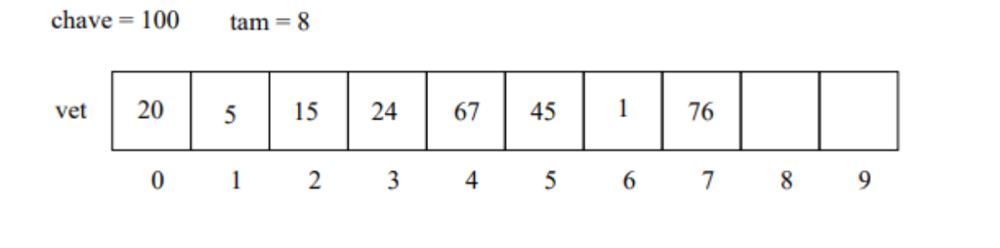

# Busca

Uma das funções mais recorrentes em programas é a busca por alguma informação. Seja a busca por alguma informação em arquivo, banco de dados ou valor armazenado em memória

Uma busca consiste em uma situação que temos uma coleção de elementos, em que cada elemento possui um identificador/chave único, e possuímos uma chave. Devemos encontrar o elemento dentro da coleção que possui a mesma chave e identificar a sua posição ou que não existe nenhuma posição com essa chave.

Definindo a função busca que deve retornar o índice que contém a chave de pesquisa. Os argumentos da função são:
    array: Coleção de elementos inteiros 
    chave: chave de pesquisa a ser consultada no vetor

Para o seguinte conjunto de parâmetros a função deverá retornar 5


Para o seguinte conjunto de parâmetros a função deverá retornar -1, pois a chave não foi encontrada no vetor



## Busca Sequencial

A busca sequencial é o algoritmo mais simples de busca e consiste nos seguintes passos:

    Percorra todo o vetor comparando a chave com o valor de cada posição

    Se for igual para alguma posição, então retorne esta posição

    Se o vetor todo foi percorrido devolva -1

No exemplo a seguir a busca linear faz a varredura no array e retorna a posição 6, pois nela existe um elemento igual a chave 33.


### Implementação

A busca sequencial pode ser implementada utilizando uma estrutura de repetição para percorrer e estruturas condicionais para comparar:


```js
const numeros = [10, 14, 19, 26, 27, 31, 33, 35, 42, 44]

function busca_seq(chave, array) {
    let tempo = 0
    for (let i = 0; i < array.length; i++) {
        tempo++
        if (array[i] == chave) {
            return [i, tempo]
        }
    }
    return [-1, tempo]
}

let [posicao, tempo] = busca_seq(3, numeros)
console.log(`O elemento buscado está na posição: ${posicao}`)
console.log(`O tempo da busca foi de: ${tempo} iterações`)
```

## Busca Sequencial Melhorada

## Busca Binária
