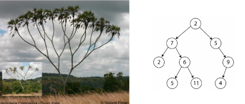
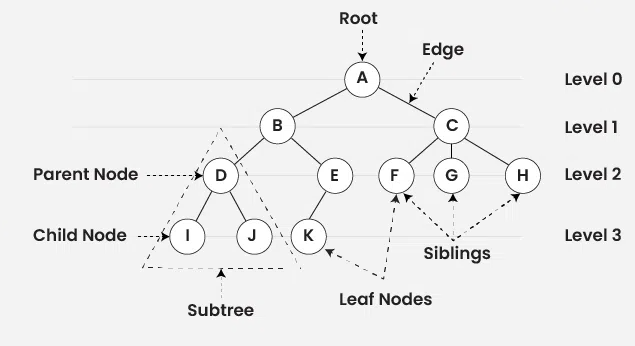
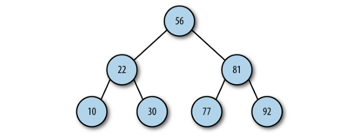
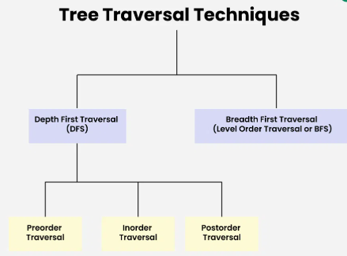
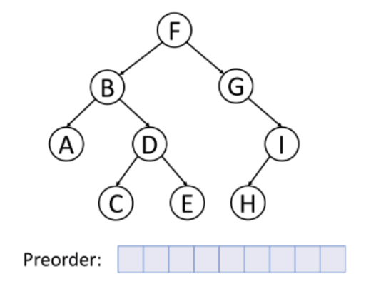
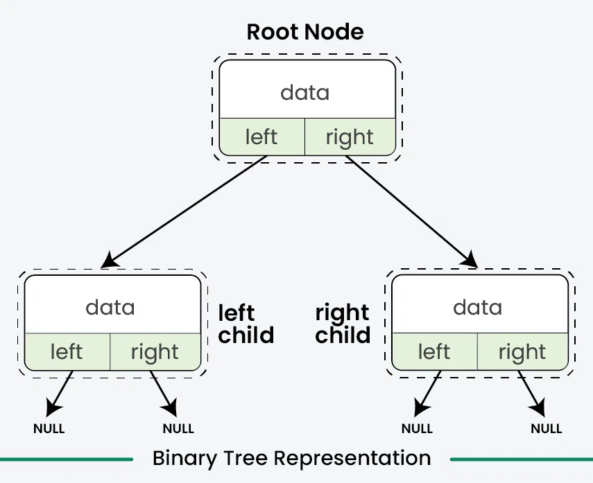

# Arvores

As árvores são uma estrutura de dados comumente usada na informática. Uma árvore é uma estrutura de dados não linear usada para armazenar dados de maneira hierárquica. São usadas para armazenar dados hierárquicos, como arquivos em um sistema de arquivos, armazenar dados ordenadas ou realizar operações especificas. 

<div align="center">

</div>


## Definição

Uma árvore é composta por um conjunto de nós conectados por arestas. O nó superior de uma árvore é chamado de nó raiz. Se um nó está conectado a outros nós abaixo dele, o nó precedente é chamado de nó pai, e os nós seguintes são chamados de nós filhos. Um nó pode ter zero, um ou mais nós filhos conectados a ele. Um nó sem nenhum nó filho é chamado de nó folha.


## Terminologia

A imagem a seguir ilustra um exemplo de árvore e possui a indicação de vários termos utilizados para descrever seus componentes.


<div align="center" >

</div>

### Root (Raiz)

A raiz da árvore é o nó que não possui nenhum nó acima dele. Todos os outros nós da árvore estão derivados a partir do mesmo. No exemplo anterior a raiz é o nó que contém o valor A.

### Level (Níveis)

Uma árvore pode ser dividida em níveis. O nó raiz está no nível 0, seus filhos estão no nível 1, os filhos desses nós estão no nível 2, e assim por diante. Um nó em qualquer nível é considerado a raiz de uma subárvore, que consiste nos filhos desse nó raiz, nos filhos dos seus filhos, e assim por diante. Podemos definir a **profundidade/altura** de uma árvore como o número de níveis na árvore.

### Edge (Aresta)

A aresta indica a ligação entre nós. Um nó só deve possuir uma aresta acima dele (com exceção da raiz) e pode possuir diversas arestas saindo do mesmo. Para árvores binárias só deve haver no máximo duas (02) arestas, uma ou nenhuma no caso de folhas.

### Subtree (Subárvore)

Uma subárvore é qualquer nó e seus respectivos descendentes. No exemplo da imagem temos diversas subárvores, como exemplo destacamos a subárvore iniciada pelo nó D e seus respectivos descendentes I e J.

### Irmão

Nós filhos do mesmo nó pai são chamados de irmãos. {D, E} são chamados de irmãos.

### Folha 

Nó folha ou nó externo são os nós que não têm nenhum nó filho. {I, J, K, F, G, H} são os nós folha da árvore.


## Exemplos

O Modelo de Objeto de Documento (DOM) de uma página HTML é uma árvore.

- Nó Raiz: O elemento \<html> é o nó raiz da árvore DOM.

- Nós Filhos: Os elementos \<head> e \<body> são filhos diretos do nó <html>.

- Descendentes: Dentro de \<head> e \<body>, há outros elementos que são filhos desses nós. Por exemplo, \<title> e \<meta> dentro de \<head>, e \<div>, \<p>, \<a>, etc., dentro de \<body>

        <html>
        ├── <head>
        │   ├── <title>
        │   ├── <meta>
        │   └── ...
        └── <body>
            ├── <div>
            │   ├── <p>
            │   └── <a>
            └── ...


O organograma de uma empresa, onde cada caixa representa um nó e as linhas conectando as caixas representam as arestas pode ser representado por uma árvore.

<div align="center" >

</div>


## Tipos

Existem diversos tipos de estruturas de dados que usam o conceito de árvore, cada uma delas possui um objetivo e operações que as mantém úteis para uma finalidade específica.

- Árvores binárias: Cada nó tem no máximo dois filhos. São usadas para armazenar dados e algoritmos de pesquisa;
- Árvore binária de busca - BTS: Uma árvore binária onde o filho esquerdo de um nó contém valores menores e o filho direito contém valores maiores;
- Árvore AVL: Uma árvore binária de busca auto-balanceada. A diferença de altura entre os filhos de qualquer nó é no máximo 1;
- Árvore Vermelho-Preta: Uma árvore binária de busca auto-balanceada onde cada nó é colorido de vermelho ou preto. Utilizada para implementação de dicionários e conjuntos ordenados;
- Árvore B: Uma árvore auto-balanceada onde cada nó pode ter mais de dois filhos. É usada para armazenar grandes quantidades de dados e em indexação em bancos de dados.

## Operações

- create: Inicializa uma nova árvore vazia ou com um nó raiz.
- insert: Adiciona um novo nó com dados específicos à árvore, a partir de algum nó especificado ou mantendo a propriedade da árvore (por exemplo, a ordem em uma árvore binária de busca).
- search: Navega pela árvore para encontrar um nó que contenha os dados desejados. Em uma árvore binária de busca, isso é feito de forma eficiente comparando valores nos nós.
- traversal: Percorre todos os nós da árvore em uma ordem específica.

    - Depth-First-Search (DFS) Traversal: Explora o máximo possível ao longo de cada ramo antes de retroceder.

        - Pré-ordem: Visita o nó raiz primeiro, depois recursivamente os filhos da esquerda para a direita.

        - Em ordem: Visita recursivamente os filhos da esquerda, depois o nó raiz, e finalmente os filhos da direita.

        - Pós-ordem: Visita recursivamente os filhos da esquerda para a direita, e finalmente o nó raiz.

    - Breadth-First-Search (BFS) Traversal: Explora todos os nós no nível atual antes de ir para os nós no próximo nível. Visita todos os nós no nível 0, depois todos os nós no nível 1, e assim por diante.


## Arvores Binárias

Uma árvore binária é aquela onde cada nó pode ter no máximo dois filhos. Ao limitar o número de filhos a dois, podemos escrever programas eficientes para inserir dados, buscar dados e deletar dados em uma árvore.

<div align="center" >

</div>

As árvores binárias podem ser consideradas cheias e completas caso a depender da organização dos seus nós:

- Cheia: Uma árvore cheia é uma árvore binária onde cada nó tem exatamente 0 ou 2 filhos. Em outras palavras, nenhum nó na árvore cheia tem apenas um filho.

- Completa: Uma árvore completa é uma árvore binária em que todos os níveis, exceto possivelmente o último, estão completamente preenchidos, e todos os nós estão o mais à esquerda possível.

### Exemplos:

Cheia e completa:

           1
          / \
         2   3
        / \ / \
       4  5 6  7

Cheia e completa:

          1
         / \
        2   3
       / \ 
      4   5

Cheia e não completa:

           1
          / \
         2   3
            / \
            6  7

Não cheia e completa:

           1
          / \
         2   3
        / \ / 
       4  5 6 

Não cheias e não completa:

           1
          / \
         2   3
          \ / 
          5 6  

## Implementações de Árvores Binárias

### Implementação com Arrays

É possível implementar árvores utilizando arrays como armazenamento. Mesmo sendo uma estrutura linear, os arrays podem ser manipulados de tal forma para que seja possível definir nós filhos a partir de uma dada posição.

#### Manipulação dos índices

A partir dos índices no array, para um nó armazenado no índice i, temos:

- O nó raiz está no índice 0.
- O filho esquerdo está no índice 2i + 1.
- O filho direito está no índice 2i + 2.
- O pai de um nó está no índice **floor((i - 1) / 2)**.


Considere a árvore a seguir:

        A
       / \
      B   C
     / \   \
    D  E    F

Podemos representar esta árvore da seguinte forma com array em javascript: 

```js

const tree = ["A", "B", "C", "D", "E", "-", "F"]

```
#### Implementação (Lab01)

```js
const tree = []

function create(size){
    return new Array(size).fill(null)
}

function root(key) {
    if (tree[0] != null) {
        console.log("Tree already had root");
    } else {
        tree[0] = key;
    }
}

function insertLeft(key, parent) {
    if (tree[parent] == null) {
        console.log(`Nó pai inválido na posição ${(parent * 2) + 1}`);
    } else {
        tree[(parent * 2) + 1] = key;
    }
}

function insertRight(key, parent) {
    if (tree[parent] == null) {
        console.log(`Nó pai inválido na posição ${(parent * 2) + 2}`);
    } else {
        tree[(parent * 2) + 2] = key;
    }
}
 
function printTree() {
    for (let i = 0; i < 10; i++) {
        if (tree[i] != null) {
            console.log(tree[i]);
        } else {
            console.log("-");
        }
    }
}
 
let t = create(10)
root("A");
insertLeft("B", 0);
insertRight("C", 0);
insertLeft("D", 1);
insertRight("E", 1);
insertRight("F", 2);
printTree();

```
#### Travessia (Lab02)

Técnicas de travessia/percurso de árvores tratam das várias maneiras de visitar todos os nós da árvore. Diferentemente das estruturas de dados lineares (Array, Lista, Filas, Pilhas, etc.), que possuem apenas uma maneira lógica de percorrê-las, as árvores podem ser percorridas de diferentes formas.

<div align="center">

</div>

##### Travessia em Ordem de Nível (Breadth First Search or BFS) 

A travessia em ordem de nível é um método para percorrer uma árvore onde todos os nós presentes no mesmo nível são percorridos completamente antes de se mover para o próximo nível. 
<div align="center">

</div>

Para realizar esta operação chamada **nodes_on_level** vamos percorrer todos os elementos em cada nível. Para isso, precisamos de uma função auxiliar que calcule a altura da árvore e para cada nível, encontre o primeiro índice e o último índice em determinado, retornando os elementos entre estes.

Iniciaremos com a função **height** que tem o objetivo de calcular a altura de uma árvore binária representada como um array. A altura da árvore é o número de níveis ou camadas que a árvore possui.

Em uma árvore binária completa, a relação entre o número de nós n e a altura h é dada por:

    𝑛 = 2**ℎ − 1

A altura seria calculada somando +1 em ambos os lados da equação e aplicando a função log_2 também em ambos os lados.

    h = log_2(n + 1)

A partir de uma dada árvore também devemos calcular qual a sua altura máxima **height** e percorrer desde a raiz até esta altura. 


```js
function height(tree) {
    return Math.ceil(Math.log2(tree.length))
}
```
A função **nodes_on_level** irá retornar um array contendo os valores naquele nível. Para isso, faz uso da premissa do cálculo de índice da esquerda:

    índice = 2 ** (level ) - 1

Após isso, percore do primeiro índice do nível até o último índice daquele nível, acumulando os elementos encontrados.
```js
function nodes_on_level(level, tree) {
    const first_index = 2 ** (level ) - 1
    const last_index = 2 ** (level + 1) - 1
    const nodes = []
    for (let i = first_index; i < last_index; i++) {
        const element = tree[i];
        if (element !== null) {
            nodes.push(element)
        }
    }
    return nodes
}
```

Por fim, temos a função travessalBFS que realiza a passagem por todos os elementos, nível a nível e os imprime em tela.

```js
function travessalBFS(tree) {
    const h = height(tree)
    for (let index = 0; index < h; index++) {
        const values = nodes_on_level(index, tree).toString();
        console.log(values)
    }
}
```
Resultado:

    A
    B,C
    D,E,F
##### Travessia em Pré-Ordem

A travessia em pré-ordem visita os nós na ordem raiz, esquerda, direita. 

<div align="center">

</div>


```js
function travessalPreOrder(tree, n = 0) {
    if (n >= 0 && n < tree.length) {
        if (tree[n]) console.log(tree[n])
        travessalPreOrder(tree, 2*n+1)
        travessalPreOrder(tree, 2*n+2)
    }
}
```
##### Travessia em Ordem

A travessia em ordem visita os nós na ordem esquerda, raiz, direita. 

Quando utilizada em árvores BST, essa travessia visita os nós em uma ordem que os nós são apresentados em ordem crescente. Isso é extremamente útil quando você precisa recuperar os elementos de uma BST em ordem classificada.

<div align="center">

</div>

```js
function travessalInOrder(tree, n = 0) {
    if (n >= 0 && n < tree.length) {
        travessalInOrder(tree, 2*n+1)
        if (tree[n]) console.log(tree[n])
        travessalInOrder(tree, 2*n+2)
    }
}
```
##### Travessia em Pós Ordem

<div align="center">

</div>


```js
function travessalPosOrder(tree, n = 0) {
    if (n >= 0 && n < tree.length) {
        travessalPosOrder(tree, 2*n+1)
        travessalPosOrder(tree, 2*n+2)
        if (tree[n]) console.log(tree[n])

    }
}
```

### Implementação com Nós Ligados

Realizando a implementação de árvore com nós, temos:
- Armazenamento dos dados
- Ponteiro para o nó da esquerda
- Ponteiro para o nó da direita




#### Manipulação dos Nós
#### Implementação (Lab03)

```js
class Node {
    constructor(value, left = null, right = null){
        this.value = value
        this.left = left
        this.right = right
    }
    toString(){
        return this.value
    }
}

```
#### Travessia (Lab04)

